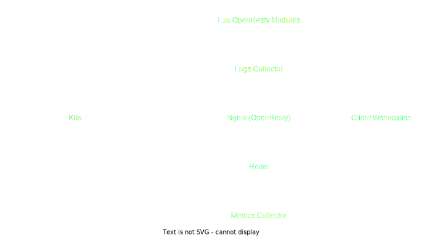

# Kubeinvaders

The first Gamified Chaos Engineering Tool for Kubernetes (backed by [platformengineering.it](https://platformengineering.it) who provides enterprise-grade features and certificated resilience services about your kubernetes infrastructure).


We have embedded a Kubeinvaders demo directly on our website to le try out the tool.

* Launch the demo at this link https://kubeinvaders.devopstribe.it/
* Watch Grafana dashboard here https://grafana.devopstribe.it
* Monitor the pod status here https://kubeopsview.devopstribe.it

[These are the slides](https://www.slideshare.net/EugenioMarzo/kubeinvaders-chaos-engineering-practices-for-kubernetes1pdf) from the Chaos Engineering speech I prepared for Fosdem 2023. Unfortunately I could not be present at my talk :D but I would still like to share them with the community

# Table of Contents

1. [Description](#Description)
2. [Installation](#Installation)
3. [Usage](#Usage)
4. [Architecture](#Architecture)
6. [Persistence](#Persistence)
7. [Generic Troubleshooting & Known Problems](#Generic-Troubleshooting-And-Known-Problems)
8. [Troubleshooting Unknown Namespace](#Troubleshooting-Unknown-Namespace)
9. [Metrics](#Metrics)
10. [Security](#Security)
12. [Community](#Community)
13. [Community blogs and videos](#Community-blogs-and-videos)
14. [License](#License)


## Description

Through **k-inv** a.k.a. KubeInvaders you can stress a Kubernetes cluster in a fun way and check how resilient it is.

## Installation

Before you start you need a token from a service account that has [this clusterrole](https://github.com/lucky-sideburn/kubeinvaders/blob/master/helm-charts/kubeinvaders/templates/rbac-cluster.yaml))

Assign the clusterrole to a Service Account and get token
```bash
kubectl create sa kinv-sa
kubectl create clusterrolebinding kinv-sa --clusterrole=cluster-admin --serviceaccount=default:kinv-sa
kubectl describe secret $(kubectl get secrets | grep kinv-sa | awk '{ print $1 }') | grep 'token:' | awk '{ print $2 }'
```

### Run through Docker or Podman
#### Params
##### K8S_TOKEN
These are the permissions your service account must have
- apiGroups: [""]
  resources: ["pods", "pods/log"]
  verbs: ["delete"]
- apiGroups: ["batch", "extensions"]
  resources: ["jobs"]
  verbs: ["get", "list", "watch", "create", "update", "patch", "delete"]
- apiGroups: ["*"]
  resources: ["*"]
  verbs: ["get", "watch", "list"]
##### ENDPOINT
Host and web console port of kubeinvaders
##### INSECURE_ENDPOINT
Select http or https for web console
##### KUBERNETES_SERVICE_HOST
Ip or dns name of your control plane
##### KUBERNETES_SERVICE_PORT_HTTPS
TCP port listening to your controlplane
#### NAMESPACE
List the namespaces you want to stress or on which you want to see logs
  
```bash
docker run -p 8080:8080 \
--env K8S_TOKEN=<k8s_service_account_token>  \
--env ENDPOINT=localhost:8080 \
--env INSECURE_ENDPOINT=true \
--env KUBERNETES_SERVICE_HOST=<k8s_controlplane_host> \
--env KUBERNETES_SERVICE_PORT_HTTPS=<k8s_controlplane_port> \
--env NAMESPACE=<comma_separated_namespaces_to_stress> \
luckysideburn/kubeinvaders:develop
```

### Install to Kubernetes with Helm (v3+)
[](https://artifacthub.io/packages/search?repo=kubeinvaders)

```bash
helm repo add kubeinvaders https://lucky-sideburn.github.io/helm-charts/
helm repo update

kubectl create namespace kubeinvaders

helm install kubeinvaders --set-string config.target_namespace="namespace1\,namespace2" \
-n kubeinvaders kubeinvaders/kubeinvaders --set ingress.enabled=true --set ingress.hostName=kubeinvaders.io --set deployment.image.tag=v1.9.6
```

### Install to Kubernetes with Helm (v3+) - LoadBalancer / HTTP (tested with GKE)

```bash
helm install kubeinvaders --set-string config.target_namespace="namespace1\,namespace2" -n kubeinvaders kubeinvaders/kubeinvaders --set ingress.enabled=true --set ingress.hostName=kubeinvaders.local --set deployment.image.tag=v1.9.6 --set service.type=LoadBalancer --set service.port=80

kubectl set env deployment/kubeinvaders INSECURE_ENDPOINT=true -n kubeinvaders
```


### SCC for Openshift

```bash
oc adm policy add-scc-to-user anyuid -z kubeinvaders
```

### Route for Openshift

I should add this to the helm chart...

```bash
apiVersion: route.openshift.io/v1
kind: Route
metadata:
  name: kubeinvaders
  namespace: "kubeinvaders"
spec:
  host: "kubeinvaders.io"
  to:
    name: kubeinvaders
  tls:
    termination: Edge
 ```

## Usage

At the top you will find some metrics as described below:


**Current Replicas State Delay** is a metric that show how much time the cluster takes to come back at the desired state of pods replicas.

This is a control-plane you can use to switch off & on various features.


### YouTube HowTo

[Video How To of version v1.9](https://www.youtube.com/watch?v=wD7ngPlNEjY)
### Start The Chaos Experiment

Press the button "Start" to start automatic pilot (button changes to "Stop" to disable this feature).
### Enable Shuffle

Press the button "Enable Shuffle" to randomly switch the positions of pods or k8s nodes (button changes to "Disable Shuffle" to disable this feature).
### Enable Auto Jump Between Namespace

Press the button "Auto NS Switch" to randomly switch between namespaces (button changes to "Disable Auto NS Switch" to disable this feature).
### Show / Hide pods name

Press the button "Hide Pods Name" to hide the name of the pods under the aliens (button changes to "Show Pods Name" to disable this feature).
### Information about current status and events

As described below, on the game screen, near the spaceship, there are details about current cluster, namespace and some configurations.


Under + and - buttons appears a bar with the latest occurred game events.


### Do Kube-linter Lint

It is possibile using [kube-linter](https://github.com/stackrox/kube-linter) through KubeInvaders in order to scan resources looking for best-practices or improvements to apply.

[Example from YouTube](https://www.youtube.com/watch?v=n_EuYjq3M-A)

### Show Special Keys

Press 'h' or select 'Show Special Keys' from the menu.

### Zoom In / Out

Press + or - buttons to increase or decrease the game screen.

### Chaos Containers for masters and workers nodes

- Select from the menu "Show Current Chaos Container for nodes" to watch which container start when you fire against a worker node (not an alien, they are pods).

- Select from the menu "Set Custom Chaos Container for nodes" to use your preferred image or configuration against nodes.

## Architecture



## Persistence

"Kinv" uses Redis for save and manage data. Redis is configured with "appendonly".

At moment the helm chart does not support PersistentVolumes but this task is in the to do list...

## Generic Troubleshooting And Known Problems

* It seems that KubeInvaders does not work with EKS because of problems with ServiceAccount.
* At moment the installation of KubeInvaders into a namespace that is not named "kubeinvaders" is not supported
* I have only tested KubeInvaders with a Kubernetes cluster installed through KubeSpray
* If you don't see aliens please do the following steps:
1. Open a terminal and do "kubectl logs <pod_of_kubeinvader> -n kubeinvaders -f"
2. Execute from another terminal `curl "https://<your_kubeinvaders_url>/kube/pods?action=list&namespace=namespace1" -k`
3. Open an issue with attached logs

## Troubleshooting Unknown Namespace

* Check if namespaces declared with helm config.target_namespace (es: config.target_namespace="namespace1\,namespace2") exist and contain some pods
* Check from your browser developer console if there some HTTP requests that fails (send them to luckysideburn[at]gmail[dot]com or open an issue on this repo
* Try v1.9.6_debug and send logs to luckysideburn[at]gmail[dot]com or open an issue on this repo
 

## Prometheus Metrics

KubeInvaders exposes metrics for Prometheus through the standard endpoint /metrics

This is an example of Prometheus configuration:

```bash
scrape_configs:
- job_name: kubeinvaders
  static_configs:
  - targets:
    - kubeinvaders.kubeinvaders.svc.cluster.local:8080
```
Example of metrics:

| Metric           | Description                                                                                                                          |  
|------------------|--------------------------------------------------------------------------------------------------------------------------------------|
|     chaos_jobs_node_count{node=workernode01}               | Total number of chaos jobs executed per node                                               |
|     chaos_node_jobs_total                                  | Total number of chaos jobs executed against all worker nodes                               |                                                      
|     deleted_pods_total 16                                  | Total number of deleted pods                                                               |
|     deleted_namespace_pods_count{namespace=myawesomenamespace}           |Total number of deleted pods per namespace                                    |                                     


## Security

In order to restrict the access to the Kubeinvaders endpoint add this annotation into the ingress.

```yaml
nginx.ingress.kubernetes.io/whitelist-source-range: <your_ip>/32
```

## Community

Please reach out for news, bugs, feature requests, and other issues via:

- On Twitter: [@kubeinvaders](https://twitter.com/kubeinvaders) & [@luckysideburn](https://twitter.com/luckysideburn)
- New features are published on YouTube too in [this channel](https://www.youtube.com/channel/UCQ5BQ8R2fDL_WkNAllYRrpQ)

## Community blogs and videos

- Kubernetes.io blog: [KubeInvaders - Gamified Chaos Engineering Tool for Kubernetes](https://kubernetes.io/blog/2020/01/22/kubeinvaders-gamified-chaos-engineering-tool-for-kubernetes/)
- acloudguru: [cncf-state-of-the-union](https://acloudguru.com/videos/kubernetes-this-month/cncf-state-of-the-union)
- DevNation RedHat Developer: [Twitter](https://twitter.com/sebi2706/status/1316681264179613707)
- Flant: [Open Source solutions for chaos engineering in Kubernetes](https://blog.flant.com/chaos-engineering-in-kubernetes-open-source-tools/)
- Reeinvent: [KubeInvaders - gamified chaos engineering](https://www.reeinvent.com/blog/kubeinvaders)
- Adrian Goins: [K8s Chaos Engineering with KubeInvaders](https://www.youtube.com/watch?v=bxT-eJCkqP8)
- dbafromthecold: [Chaos engineering for SQL Server running on AKS using KubeInvaders](https://dbafromthecold.com/2019/07/03/chaos-engineering-for-sql-server-running-on-aks-using-kubeinvaders/)
- Pklinker: [Gamification of Kubernetes Chaos Testing](https://pklinker.medium.com/gamification-of-kubernetes-chaos-testing-bd2f7a7b6037)
- Openshift Commons Briefings: [OpenShift Commons Briefing KubeInvaders: Chaos Engineering Tool for Kubernetes](https://www.youtube.com/watch?v=3OOXOCTAYF0&t=4s)
- GitHub: [awesome-kubernetes repo](https://github.com/ramitsurana/awesome-kubernetes)
- William Lam: [Interesting Kubernetes application demos](https://williamlam.com/2020/06/interesting-kubernetes-application-demos.html)
- The Chief I/O: [5 Fun Ways to Use Kubernetes ](https://thechief.io/c/editorial/5-fun-ways-use-kubernetes/?utm_source=twitter&utm_medium=social&utm_campaign=thechiefio&utm_content=articlesfromthechiefio)
- LuCkySideburn: [Talk @ Codemotion](https://www.slideshare.net/EugenioMarzo/kubeinvaders-chaos-engineering-tool-for-kubernetes-and-openshift)
- Chaos Carnival: [Chaos Engineering is fun!](https://www.youtube.com/watch?v=10tHPl67A9I&t=3s)
- Kubeinvaders (old version) + OpenShift 4 Demo: [YouTube_Video](https://www.youtube.com/watch?v=kXm2uU5vlp4)
- KubeInvaders (old version) Vs Openshift 4.1: [YouTube_Video](https://www.youtube.com/watch?v=7R9ftgB-JYU)
- Chaos Engineering for SQL Server | Andrew Pruski | Conf42: Chaos Engineering: [YouTube_Video](https://www.youtube.com/watch?v=HCy3sjMRvlI)
- nicholaschangblog: [Introducing Azure Chaos Studio](https://nicholaschangblog.com/azure/introduction-to-azure-choas-studio/)
- bugbug: [Chaos Testing: Everything You Need To Know](https://bugbug.io/blog/software-testing/chaos-testing-guide/)


## License

KubeInvaders is licensed under the Apache License, Version 2.0. See [LICENSE](./LICENSE) for the full license text.
