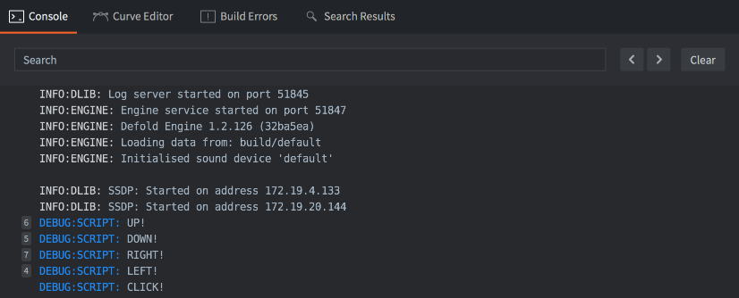
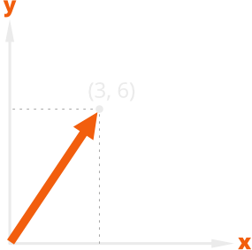
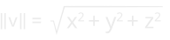
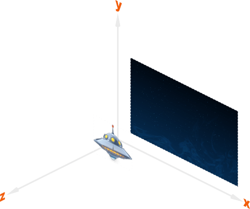
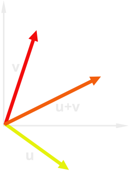
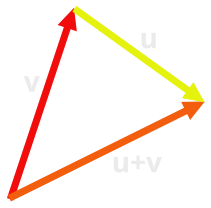
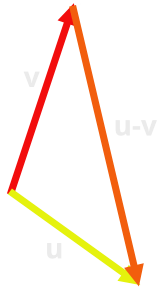
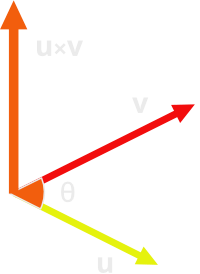
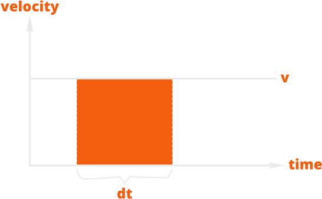
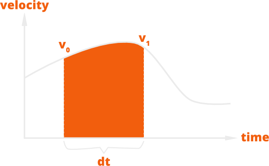

# Movement tutorial

This is a tutorial for beginners. It walks you through the steps of creating a player controlled space ship that moves in a natural manner when you give keyboard input. After having completed this tutorial you will know the answers to the following questions:

* What are vectors?
* How can you use vectors to represent positions, velocity and acceleration?
* How do you use this to create a game embryo that you can experiment with and develop further?

It is assumed that you have basic understanding of physics concepts such as velocity and acceleration. You will also need some basic understanding of Lua programming.

This project is prepared in advance for you so there is no setup to bother about. [Run the game](defold://build) to get an overview of what you have to work with:

- It include graphics: an animated spaceship and a background.
- Input is set up for arrow keys and mouse clicks.
- There is a "spaceship" game object that has a script attached to it.
- The script has code in place to react to player input. Initially, it only prints messages to the console as a reaction to input.

With the game running, try pressing the arrow buttons, or click in the game window, then check the editor console for input results. Notice that different text is printed in the console depending on which button you pressed:



## Making the spaceship move

Before digging into any details, let's first make a simple experiment and give the spaceship motion.

Open ["spaceship.script"](defold://open?path=/main/spaceship.script) and scroll down to the beginning of the function `on_input()` where you find this code:

```lua
function on_input(self, action_id, action)
    if action_id == hash("up") then
        print("UP!")
    elseif...
```

Remove the line with the statement `print("UP!")` and edit the code so the beginning of the function instead looks like this:

```lua
function on_input(self, action_id, action)
    if action_id == hash("up") then
        local p = go.get_position()
        p.y = p.y + 1
        go.set_position(p)
    elseif...
```

[Run the game](defold://build) again and press the <kbd>up</kbd> arrow key and see how the spaceship moves up. The code is very simple, but let's look at it line by line to get a proper idea of what's going on:

```lua
if action_id == hash("up") then
```

The input bindings that are set up in the project (in the file ["/input/game.input_binding"](defold://open?path=/input/game.input_binding)) binds each of the arrow keys to action named "up", "down", "left" and "right". The game runs at 60 frames per second and each frame you push <kbd>up</kbd>, the [hashed](https://en.wikipedia.org/wiki/Hash_function) "up" action name is sent to the `on_input()` function. Holding the button down will thus make the code between the `if` statement and the first `elseif` execute 60 times each second.

```lua
local p = go.get_position()
```

The function `go.get_position()` gets the position of a game object. Since the function is called without any arguments, the position of the *current* game object is returned. This code belongs to the spaceship game object so the position of the spaceship is returned.

The position is assigned to a local variable called `p` so it is possible to manipulate it. The position object is a `vector3`, which is a *vector* that holds three values.

```lua
p.y = p.y + 1
```

The `vector3` object in `p` describes a point in 3D space, consisting of an X coordinate, an Y coordinate and a Z coordinate. Since pressing the <kbd>up</kbd> button should move the ship in the positive direction of the Y axis, the `y` component of the position is increased by 1.

```lua
go.set_position(p)
```

Finally, the new changed position value is written back to the current game object.

Before moving on, try changing the value added to `p.y` from 1 to 5 and [run the game again](defold://build). Notice how the ship now moves much faster.

Finally, add a line below `go.set_position(p)` to print the value of `p`:

```lua
function on_input(self, action_id, action)
    if action_id == hash("up") then
        local p = go.get_position()
        p.y = p.y + 5
        go.set_position(p)
        print(p)
    elseif...
```

[Run the game again](defold://build) and see how the engine print the value of the position vector each frame. Notice that the second value of the vector changes as the spaceship moves:

```text
...
DEBUG:SCRIPT: vmath.vector3(640, 460, 0)
DEBUG:SCRIPT: vmath.vector3(640, 465, 0)
DEBUG:SCRIPT: vmath.vector3(640, 470, 0)
DEBUG:SCRIPT: vmath.vector3(640, 475, 0)
...
```

## Vectors

A vector is a mathematical entity that has a _direction_ and a _magnitude_ (length). A vector describes a specific point in a vector space. In practice, a vector consists of a set of numbers that give the coordinates to the point. In a two dimensional space (a plane), two numbers are necessary to describe vectors: one value for the X axis and one for the Y axis:



In a three dimensional space, you need three numbers: one for the X axis, one for the Y axis and one for the Z axis:


The magnitude, or length, of a vector *v* is calculated using the Pythagorean theorum:



A vector with magnitude 1 is called a *normalized vector*.

Even though Defold has a toolset tailored for 2D games, the engine is truly a 3D engine. All game objects and components are positioned in 3D space with positions expressed as `vector3` objects. When you view your game in 2D, the X and Y value determine the position of an object along the "width" and "height" axis, and the Z position determines the position along the "depth" axis. The Z position allows you to control the visibility of overlapping objects: a sprite with a Z value of 1 will appear in front of a sprite at Z position 0. By default, Defold uses a coordinate system allowing Z values between -1 and 1:



The Defold Lua library [`vmath`](https://defold.com/ref/vmath) contains functions to create and manipulate [`vector3`](https://defold.com/ref/vmath/#vmath.vector3) objects:

```lua
-- create a new vector3 at X position 100 and Y position 350.
local position = vmath.vector3(100, 350, 0)

-- set the position of game object "player" to the new vector.
go.set_position(position, "player")
```

Vectors in higher dimensions than 3 are also possible. Defold uses `vector4` objects with four components to encode colors. The first three components give the amount of red, green, and blue, and the last component give the amount of translucency, also called "alpha".

In everyday life you are used to do arithmetic with scalar values, real numbers that describe points on the number line. We use scalars to mean many different things. The number 12 could mean a number of meters, kilograms, pounds, seconds, meters per second, volts or dollars. The same is true for vectors. You have already seen how vectors can be used to describe a position of an object. They are also very good for describing an object's motion through space.

To describe motion on a computer screen (a 2D plane) you need two values: The speed along the X axis and the speed along the Y axis. You can very well use two separate scalar values and add the speed values to the X and Y positions separately:

```lua
position_x = position_x + speed_x * elapsed_seconds
position_y = position_y + speed_y * elapsed_seconds
```

This is roughly what you did when you previously made the spaceship move upwards, and there is nothing wrong calculating motion like this. Vectors, however, allow you to express motion clearer and more concise. Since a vector describe a *direction* and a *magnitude* they are an intuitive fit for motion: the direction of the vector equals the direction of motion, and the magnitude describes the amount of motion:

```lua
position = position + speed * elapsed_seconds
```

As long as the `position` and `speed` values are expressed as vectors in the same space you can add and subtract them, and scale them by multiplying them with scalar values. These operations are a central part of *vector algebra*.

## Vector algebra

Vector algebra defines mathematical operations on vectors. Beginning with the simplest, negation, addition and subtraction.

Negation
: Negating a vector *v*, denoted by -*v*, negates each component of the vector. This makes a vector that points in the opposite direction of the original vector, with the same magnitude:

  

Addition
: Adding vector *u* to vector *v*, denoted by *u* + *v*, adds each component of *u* to *v*. The result is a new vector:

  

  Vectors are often drawn displaced from the coordinate system which brings clarity to the operations:

  

Subtraction
: Subtracting vector *v* from vector *u*, denoted by *u* - *v*, is equal to adding the negation of *v* to *u*. So *u* - *v* = *u* + (-*v*):

  

Multiplication with scalar
: Multiplying a vector *v* with a real number *r* produces a new vector with the magnitude scaled: the vector is streched out by a factor *r*. Multiplying with a negative *r* flips the orientation 180 degrees:
  
  

These were the basic operations on vectors that you will use all the time. In addition, there are two special operations that come in handy if you, for instance, want to check if two vectors are parallel or at right angles of each other:

Dot product
: The dot product of two vectors *u* and *v*, denoted by *u ∙ v*, is a scalar value. It is defined as:

  

  - *‖u‖* is the magnitude of vector *u*.
  - *‖v‖* is the magnitude of vector *v*.
  - *θ* is the angle between the vectors.

  

  If the vectors are orthogonal (the angle between them is 90 degrees), then the dot product is zero.

Cross product
: The cross product of two vectors *u* and *v*, denoted by *u* × *v*, is a vector that is perpendicular to both *u* and *v*:

  

  The resulting vector is a zero vector if:

  - Either one or both of the input vectors are zero vectors, (*u* = 0 or *v* = 0)
  - The two input vectors are parallel (θ = 0°)
  - The two input vectors are antiparallel (θ = 180°)

## Creating movement with vectors

Using vector algebra, you can now rewrite the spaceship's movement in a straightforward way.

Open ["spaceship.script"](defold://open?path=/main/spaceship.script) and modify the `init()`, `update()` and `on_input()` functions:

```lua
function init(self)
    msg.post(".", "acquire_input_focus")
    self.input = vmath.vector3()                -- [1]
end
```
1. Create a new zero `vector3` for storing the input direction. It is placed it in the current script instance (`self`) so it can be used throughout the lifetime of the spaceship game object.

```lua
function update(self, dt)
    local movement = self.input * 3             -- [1]
    local p = go.get_position()                 -- [2]
    go.set_position(p + movement)               -- [3]
    self.input = vmath.vector3()                -- [4]
end
```
1. Calculate a movement vector based on the player's input vector.
2. Retrieve the position of the current game object (the spaceship). The position is a `vector3`.
2. Set the position of the current game object to `p` plus the movement vector.
3. Zero the input vector. The `on_input()` function is called each frame before `update()` and has the responsibility to set the input vector.

```lua
function on_input(self, action_id, action)
    if action_id == hash("up") then
        self.input.y = 1                     -- [1]
    elseif action_id == hash("down") then
        self.input.y = -1                    -- [1]
    elseif action_id == hash("left") then
        self.input.x = -1                    -- [1]
    elseif action_id == hash("right") then
        self.input.x = 1                     -- [1]
    elseif action_id == hash("click") and action.pressed then
        print("CLICK!")
    end
end
```
1. Set the x or y component of the input vector depending on player input. If the player presses `up` and `left` at the same time, the function will be called twice and both components are set, resulting in a diagonal input direction.

There are two issues with this code:

First, the input vector has length 1 if you move vertically or horizontally, but diagonally the length is 1.4142 (square root of 2) so diagonal movement is faster. You probably don't want that.

Second, the units of velocity is expressed in pixels/frame, no matter the frame length. It's set to 3 pixels of movement each frame (or about 4.2 diagonally). To make the ship go faster, change the 3 to a higher value. If you want it to go slower, decrease the value. It would be better if you could express velocity in pixels/second.

The first problem is easy to fix, just normalize the input vector so the input length is always 1:

```lua
function update(self, dt)
    if vmath.length_sqr(self.input) > 1 then        -- [1]
        self.input = vmath.normalize(self.input)
    end
    local movement = self.input * 3
    local p = go.get_position()
    go.set_position(p + movement)
    self.input = vmath.vector3()
end
```
1. If the squared length of the input vector is larger than 1, normalize the vector so it is of magnitude 1. Compare against square length since it's faster than comparing against length.

The second problem requires the use of a time step value.

## Time step

Each frame the Defold engine calls the `update()` function of each script. A Defold game usually runs at 60 frames per second, so each frame is 0.016666 seconds long. That is the time elapsed between each call to `update()`. A velocity vector with a magnitude of 3 will then represent a speed of 3 * 60 = 180 pixels per second (with the regular render script), *as long as there really are 60 frames each second*. What would happen if there, for whatever reason, is a hitch in the framerate? With the current code movement will be uneven and unpredictable.

Working with pixels per second allows you to use variable framerate properly, you would also be able to measure your game with a stopwatch and reason about distances and timings in a better way.

Defold provides a time step argument value to the `update()` function. The argument is usually called `dt` (for "delta time") and its value is the number of *seconds* that elapsed since the last frame. If you scale velocity against `dt` you will get proper units:

```lua
function update(self, dt)
    if vmath.length_sqr(self.input) > 1 then
        self.input = vmath.normalize(self.input)
    end
    local movement = self.input * 150 * dt              -- [1]  
    local p = go.get_position()
    go.set_position(p + movement)
    self.input = vmath.vector3()
end
```
1. The velocity is now 150 pixels per second. The screen is 1280 pixels wide so it should take the ship 8.53 seconds to fly across. You can check that with a stopwatch.

[Run the game again](defold://build) and try the movement code. At this stage it works but it's stiff and not very dynamic. To give a sense of weight to the spaceship a good way is to have the player's input control movement by altering acceleration instead of the velocity.

## Acceleration

In the above code, velocity was set to a constant value, meaning that the resulting movement, or translation, of the velocity acting over the time step (`dt`) could be calculated by multiplying the velocity with the time step: *movement* = *velocity* * *dt*, or the orange area in the following diagram:



Acceleration defines how fast something changes speed and direction. The acceleration is acting over the frame time step (`dt`) and then added to the velocity. The velocity acts over the frame and the resulting movement is added to the position. Since velocity changes over time the movement has to be calculated as the area under a curve. In mathematics, this is called [integration over time](http://en.wikipedia.org/wiki/Integral).



With a small enough time step a good geometric approximation of the area can be calculated by assuming that the acceleration acting between *v0* and *v1* is constant, meaning that the velocity changes linearly between the two points. By that assumption *v1* can be calculated as *v0* + *acceleration* * *dt* and the resulting movement becomes:


You can now write the final code for `init()` and `update()` (the code for `on_input()` is kept as is):

```lua
function init(self)
    msg.post(".", "acquire_input_focus")
    self.velocity = vmath.vector3()             -- [1]
    self.input = vmath.vector3()
end

function update(self, dt)
    if vmath.length_sqr(self.input) > 1 then
        self.input = vmath.normalize(self.input)
    end
    
    local acceleration = self.input * 200       -- [2]
    
    local dv = acceleration * dt                -- [3]
    local v0 = self.velocity                    -- [4]
    local v1 = self.velocity + dv               -- [5]
    local movement = (v0 + v1) * dt * 0.5       -- [6]

    local p = go.get_position()
    go.set_position(p + movement)               -- [7]

    self.velocity = v1                          -- [8]
    self.input = vmath.vector3()
end
```
1. Create a vector for storing velocity over time.
2. Acceleration is set to 200 pixels per second in the direction of player input.
3. Calculate change of velocity this time step.
4. v0 is set to the velocity from the previous time step.
5. v1 is v0 plus the change of velocity this time step.
6. Calculate how much the ship shall move this time step.
7. Apply the change in position.
8. Store the v1 velocity so it can be used in next time step.

Now it's time to [take your new heavy spaceship for a spin](defold://build).

Congratulations! You have completed the tutorial. But don't stop here. to continue experimenting with the code.

Here are some ideas what you can try:

1. Put a cap on the velocity.
2. Make the spaceship bounce off the edges of the screen.
3. Allow mouse clicks to dictate the input direction.

Check out [the documentation pages](https://defold.com/learn) for more examples, tutorials, manuals and API docs.

If you run into trouble, help is available in [our forum](https://forum.defold.com).

Happy Defolding!

----

This project is released under the Creative Commons CC0 1.0 Universal license.

You’re free to use these assets in any project, personal or commercial. There’s no need to ask permission before using these. Giving attribution is not required, but is greatly appreciated!
[Full license text](https://creativecommons.org/publicdomain/zero/1.0)
