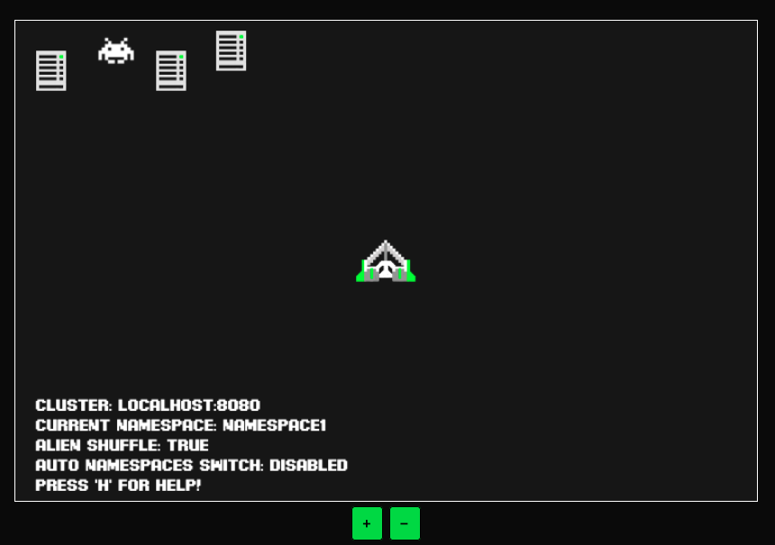
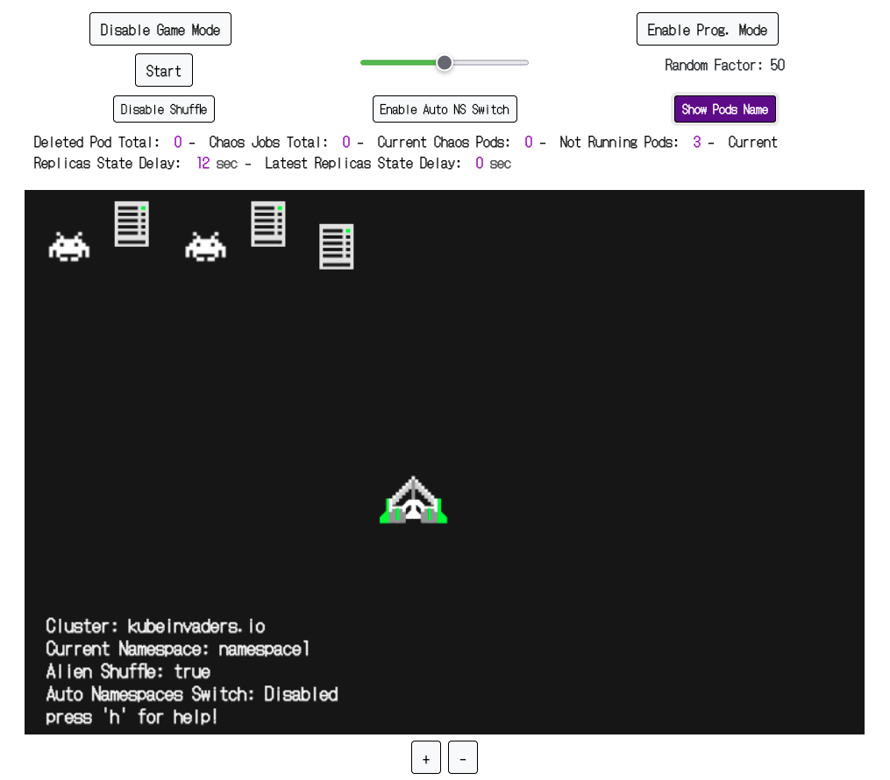
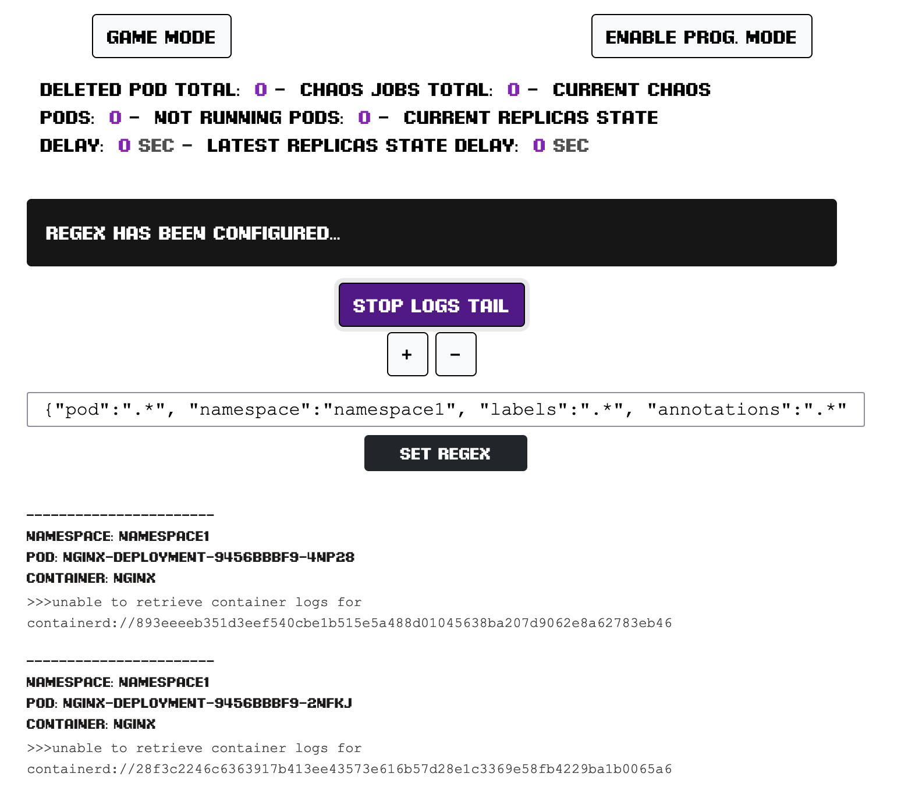
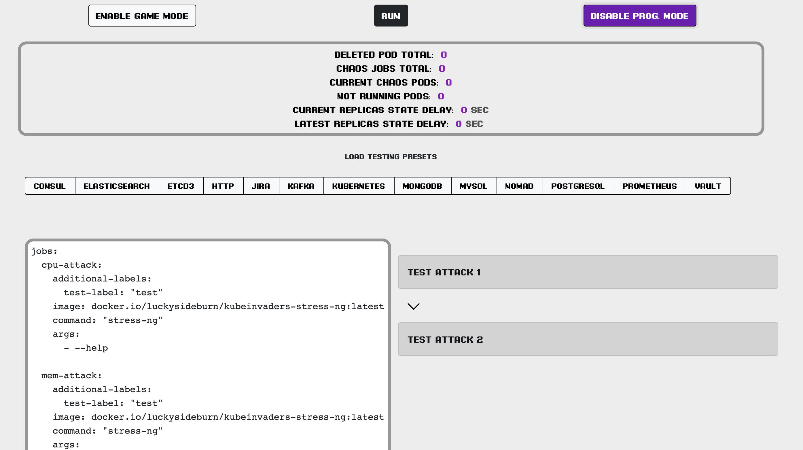
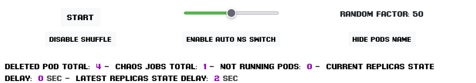
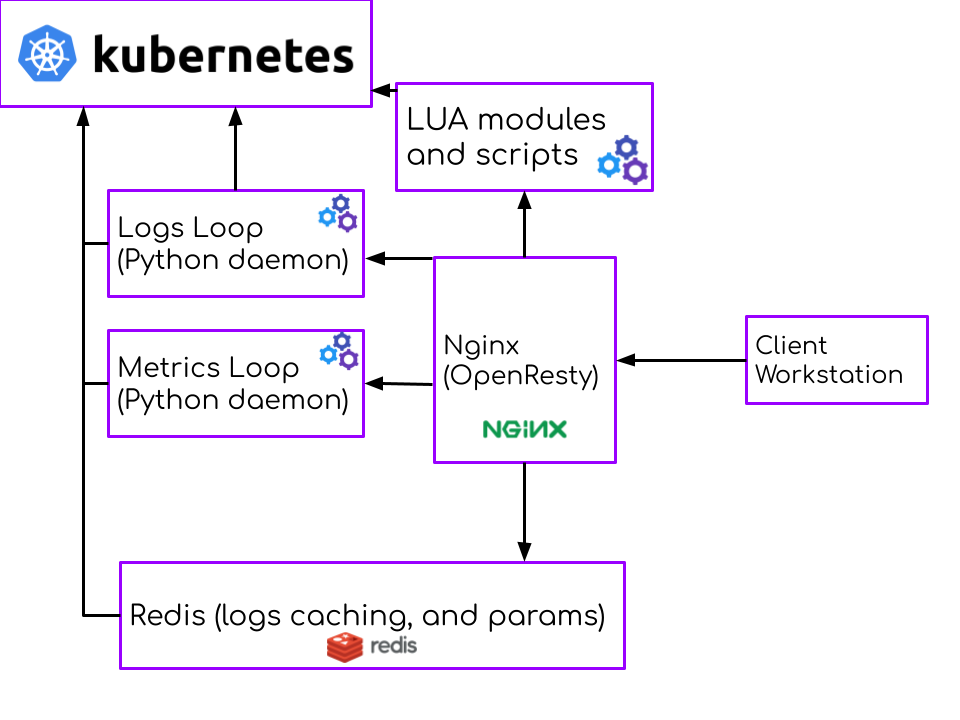

# Table of Contents

1. [Description](#Description)
2. [Installation](#Installation)
3. [Usage](#Usage)
4. [Architecture](#Architecture)
6. [Persistence](#Persistence)
7. [Generic Troubleshooting & Known Problems](#Generic-Troubleshooting-And-Known-Problems)
8. [Troubleshooting Unknown Namespace](#Troubleshooting-Unknown-Namespace)
9. [Metrics](#Metrics)
10. [Security](#Security)
11. [Test Loading and Chaos Experiment Presets](#Test-Loading-and-Chaos-Experiment-Presets)
12. [Community](#Community)
13. [Community blogs and videos](#Community-blogs-and-videos)
14. [License](#License)

[These are the slides](https://www.slideshare.net/EugenioMarzo/kubeinvaders-chaos-engineering-practices-for-kubernetes1pdf)
 from the Chaos Engineering speech I prepared for Fosdem 2023. Unfortunately I could not be present at my talk :D but I would still like to share them with the community





### Watch Kubernetes logs through web tail console


### Define Chaos Experiments


## Description

Through **k-inv** a.k.a. KubeInvaders you can stress a Kubernetes cluster in a fun way and check how resilient it is.

## Installation

### Try with Docker (only for development purpose)

```bash
docker run -p 8080:8080 \
--env K8S_TOKEN=<k8s_service_account_token>  \
--env ENDPOINT=localhost:8080 \
--env INSECURE_ENDPOINT=true \
--env KUBERNETES_SERVICE_HOST=<k8s_controlplane_host> \
--env KUBERNETES_SERVICE_PORT_HTTPS=<k8s_controlplane_port> \
--env NAMESPACE=<comma_separated_namespaces_to_stress> \
luckysideburn/kubeinvaders:develop
```

### Install to Kubernetes with Helm (v3+)
[](https://artifacthub.io/packages/search?repo=kubeinvaders)

```bash
helm repo add kubeinvaders https://lucky-sideburn.github.io/helm-charts/
helm repo update

kubectl create namespace kubeinvaders

helm install kubeinvaders --set-string config.target_namespace="namespace1\,namespace2" \
-n kubeinvaders kubeinvaders/kubeinvaders --set ingress.enabled=true --set ingress.hostName=kubeinvaders.io --set deployment.image.tag=v1.9.6
```

### Install to Kubernetes with Helm (v3+) - LoadBalancer / HTTP (tested with GKE)

```bash
helm install kubeinvaders --set-string config.target_namespace="namespace1\,namespace2" -n kubeinvaders kubeinvaders/kubeinvaders --set ingress.enabled=true --set ingress.hostName=kubeinvaders.local --set deployment.image.tag=v1.9.6 --set service.type=LoadBalancer --set service.port=80

kubectl set env deployment/kubeinvaders INSECURE_ENDPOINT=true -n kubeinvaders
```


### SCC for Openshift

```bash
oc adm policy add-scc-to-user anyuid -z kubeinvaders
```

### Route for Openshift

I should add this to the helm chart...

```bash
apiVersion: route.openshift.io/v1
kind: Route
metadata:
  name: kubeinvaders
  namespace: "kubeinvaders"
spec:
  host: "kubeinvaders.io"
  to:
    name: kubeinvaders
  tls:
    termination: Edge
 ```

## Usage

At the top you will find some metrics as described below:



**Current Replicas State Delay** is a metric that show how much time the cluster takes to come back at the desired state of pods replicas.

This is a control-plane you can use to switch off & on various features.


### YouTube HowTo

[Video How To of version v1.9](https://www.youtube.com/watch?v=wD7ngPlNEjY)
### Start The Chaos Experiment

Press the button "Start" to start automatic pilot (button changes to "Stop" to disable this feature).
### Enable Shuffle

Press the button "Enable Shuffle" to randomly switch the positions of pods or k8s nodes (button changes to "Disable Shuffle" to disable this feature).
### Enable Auto Jump Between Namespace

Press the button "Auto NS Switch" to randomly switch between namespaces (button changes to "Disable Auto NS Switch" to disable this feature).
### Show / Hide pods name

Press the button "Hide Pods Name" to hide the name of the pods under the aliens (button changes to "Show Pods Name" to disable this feature).
### Information about current status and events

As described below, on the game screen, near the spaceship, there are details about current cluster, namespace and some configurations.


Under + and - buttons appears a bar with the latest occurred game events.


### Do Kube-linter Lint

It is possibile using [kube-linter](https://github.com/stackrox/kube-linter) through KubeInvaders in order to scan resources looking for best-practices or improvements to apply.

[Example from YouTube](https://www.youtube.com/watch?v=n_EuYjq3M-A)

### Show Special Keys

Press 'h' or select 'Show Special Keys' from the menu.

### Zoom In / Out

Press + or - buttons to increase or decrease the game screen.

### Chaos Containers for masters and workers nodes

- Select from the menu "Show Current Chaos Container for nodes" to watch which container start when you fire against a worker node (not an alien, they are pods).

- Select from the menu "Set Custom Chaos Container for nodes" to use your preferred image or configuration against nodes.

## Architecture



## Persistence

"Kinv" uses Redis for save and manage data. Redis is configured with "appendonly".

At moment the helm chart does not support PersistentVolumes but this task is in the to do list...

## Generic Troubleshooting And Known Problems

* It seems that KubeInvaders does not work with EKS because of problems with ServiceAccount.
* At moment the installation of KubeInvaders into a namespace that is not named "kubeinvaders" is not supported
* I have only tested KubeInvaders with a Kubernetes cluster installed through KubeSpray
* If you don't see aliens please do the following steps:
1. Open a terminal and do "kubectl logs <pod_of_kubeinvader> -n kubeinvaders -f"
2. Execute from another terminal `curl "https://<your_kubeinvaders_url>/kube/pods?action=list&namespace=namespace1" -k`
3. Open an issue with attached logs

## Troubleshooting Unknown Namespace

* Check if namespaces declared with helm config.target_namespace (es: config.target_namespace="namespace1\,namespace2") exist and contain some pods
* Check from your browser developer console if there some HTTP requests that fails (send them to luckysideburn[at]gmail[dot]com or open an issue on this repo
* Try v1.9.6_debug and send logs to luckysideburn[at]gmail[dot]com or open an issue on this repo
 
## Hands-on Tutorial

To experience KubeInvaders in action, try it out in this free O'Reilly Katacoda scenario, [KubeInvaders](https://www.katacoda.com/kuber-ru/courses/kubernetes-chaos).

## Prometheus Metrics

KubeInvaders exposes metrics for Prometheus through the standard endpoint /metrics

This is an example of Prometheus configuration:

```bash
scrape_configs:
- job_name: kubeinvaders
  static_configs:
  - targets:
    - kubeinvaders.kubeinvaders.svc.cluster.local:8080
```
Example of metrics:

| Metric           | Description                                                                                                                          |  
|------------------|--------------------------------------------------------------------------------------------------------------------------------------|
|     chaos_jobs_node_count{node=workernode01}               | Total number of chaos jobs executed per node                                               |
|     chaos_node_jobs_total                                  | Total number of chaos jobs executed against all worker nodes                               |                                                      
|     deleted_pods_total 16                                  | Total number of deleted pods                                                               |
|     deleted_namespace_pods_count{namespace=myawesomenamespace}           |Total number of deleted pods per namespace                                    |                                     


## Security

In order to restrict the access to the Kubeinvaders endpoint add this annotation into the ingress.

```yaml
nginx.ingress.kubernetes.io/whitelist-source-range: <your_ip>/32
```

## Test Loading and Chaos Experiment Presets
### Cassandra
```python
from cassandra.cluster import Cluster
from random import randint
import time

def main():
    cluster = Cluster(['127.0.0.1'])
    session = cluster.connect()

    session.execute("CREATE KEYSPACE IF NOT EXISTS test WITH REPLICATION = { 'class': 'SimpleStrategy', 'replication_factor': 1 }")
    session.execute("CREATE TABLE IF NOT EXISTS test.messages (id int PRIMARY KEY, message text)")

    for i in range(1000):
        session.execute("INSERT INTO test.messages (id, message) VALUES (%s, '%s')" % (i, str(randint(0, 1000))))
        time.sleep(0.001)

    cluster.shutdown()

if __name__ == "__main__":
    main()
```


### Consul
```python
import time
import consul

# Connect to the Consul cluster
client = consul.Consul()

# Continuously register and deregister a service
while True:
    # Register the service
    client.agent.service.register(
        "stress-test-service",
        port=8080,
        tags=["stress-test"],
        check=consul.Check().tcp("localhost", 8080, "10s")
    )

    # Deregister the service
    client.agent.service.deregister("stress-test-service")

    time.sleep(1)


```


### Elasticsearch
```python
import time
from elasticsearch import Elasticsearch

# Connect to the Elasticsearch cluster
es = Elasticsearch(["localhost"])

# Continuously index and delete documents
while True:
    # Index a document
    es.index(index="test-index", doc_type="test-type", id=1, body={"test": "test"})

    # Delete the document
    es.delete(index="test-index", doc_type="test-type", id=1)

    time.sleep(1)


```


### Etcd3
```python
import time
import etcd3

# Connect to the etcd3 cluster
client = etcd3.client()

# Continuously set and delete keys
while True:
    # Set a key
    client.put("/stress-test-key", "stress test value")

    # Delete the key
    client.delete("/stress-test-key")

    time.sleep(1)


```


### Gitlab
```python
import gitlab
import requests
import time

gl = gitlab.Gitlab('https://gitlab.example.com', private_token='my_private_token')

def create_project():
    project = gl.projects.create({'name': 'My Project'})
    print("Created project: ", project.name)

def main():
    for i in range(1000):
        create_project()
        time.sleep(0.001)

if __name__ == "__main__":
    main()
```


### Http
```python
import time
import requests

# Set up the URL to send requests to
url = 'http://localhost:8080/'

# Set up the number of requests to send
num_requests = 10000

# Set up the payload to send
payload = {'key': 'value'}

# Send the requests
start_time = time.time()
for i in range(num_requests):
    requests.post(url, json=payload)
end_time = time.time()

# Calculate the throughput
throughput = num_requests / (end_time - start_time)
print(f'Throughput: {throughput} requests/second')


```


### Jira
```python
import time
from jira import JIRA

# Connect to the Jira instance
jira = JIRA(
    server="https://jira.example.com",
    basic_auth=("user", "password")
)

# Continuously create and delete issues
while True:
    # Create an issue
    issue = jira.create_issue(
        project="PROJECT",
        summary="Stress test issue",
        description="This is a stress test issue.",
        issuetype={"name": "Bug"}
    )

    # Delete the issue
    jira.delete_issue(issue)

    time.sleep(1)


```


### Kafka
```python
import time
import random

from kafka import KafkaProducer

# Set up the Kafka producer
producer = KafkaProducer(bootstrap_servers=['localhost:9092'])

# Set up the topic to send messages to
topic = 'test'

# Set up the number of messages to send
num_messages = 10000

# Set up the payload to send
payload = b'a' * 1000000

# Send the messages
start_time = time.time()
for i in range(num_messages):
    producer.send(topic, payload)
end_time = time.time()

# Calculate the throughput
throughput = num_messages / (end_time - start_time)
print(f'Throughput: {throughput} messages/second')

# Flush and close the producer
producer.flush()
producer.close()

```


### Kubernetes
```python
import time
import kubernetes

# Create a Kubernetes client
client = kubernetes.client.CoreV1Api()

# Continuously create and delete pods
while True:
    # Create a pod
    pod = kubernetes.client.V1Pod(
        metadata=kubernetes.client.V1ObjectMeta(name="stress-test-pod"),
        spec=kubernetes.client.V1PodSpec(
            containers=[kubernetes.client.V1Container(
                name="stress-test-container",
                image="nginx:latest"
            )]
        )
    )
    client.create_namespaced_pod(namespace="default", body=pod)

    # Delete the pod
    client.delete_namespaced_pod(name="stress-test-pod", namespace="default")

    time.sleep(1)


```


### Mongodb
```python
import time
import random
from pymongo import MongoClient

# Set up the MongoDB client
client = MongoClient('mongodb://localhost:27017/')

# Set up the database and collection to use
db = client['test']
collection = db['test']

# Set up the number of documents to insert
num_documents = 10000

# Set up the payload to insert
payload = {'key': 'a' * 1000000}

# Insert the documents
start_time = time.time()
for i in range(num_documents):
    collection.insert_one(payload)
end_time = time.time()

# Calculate the throughput
throughput = num_documents / (end_time - start_time)
print(f'Throughput: {throughput} documents/second')

# Close the client
client.close()


```


### Mysql
```python
import time
import mysql.connector

# Connect to the MySQL database
cnx = mysql.connector.connect(
    host="localhost",
    user="root",
    password="password",
    database="test"
)
cursor = cnx.cursor()

# Continuously insert rows into the "test_table" table
while True:
    cursor.execute("INSERT INTO test_table (col1, col2) VALUES (%s, %s)", (1, 2))
    cnx.commit()
    time.sleep(1)

# Close the database connection
cnx.close()


```


### Nomad
```python
import time
import nomad

# Create a Nomad client
client = nomad.Nomad()

# Create a batch of jobs to submit to Nomad
jobs = [{
    "Name": "stress-test-job",
    "Type": "batch",
    "Datacenters": ["dc1"],
    "TaskGroups": [{
        "Name": "stress-test-task-group",
        "Tasks": [{
            "Name": "stress-test-task",
            "Driver": "raw_exec",
            "Config": {
                "command": "sleep 10"
            },
            "Resources": {
                "CPU": 500,
                "MemoryMB": 512
            }
        }]
    }]
}]

# Continuously submit the batch of jobs to Nomad
while True:
    for job in jobs:
        client.jobs.create(job)
    time.sleep(1)


```


### Postgresql
```python
import time
import random
import psycopg2

# Set up the connection parameters
params = {
    'host': 'localhost',
    'port': '5432',
    'database': 'test',
    'user': 'postgres',
    'password': 'password'
}

# Connect to the database
conn = psycopg2.connect(**params)

# Set up the cursor
cur = conn.cursor()

# Set up the table and payload to insert
table_name = 'test'
payload = 'a' * 1000000

# Set up the number of rows to insert
num_rows = 10000

# Insert the rows
start_time = time.time()
for i in range(num_rows):
    cur.execute(f"INSERT INTO {table_name} (col) VALUES ('{payload}')")
conn.commit()
end_time = time.time()

# Calculate the throughput
throughput = num_rows / (end_time - start_time)
print(f'Throughput: {throughput} rows/second')

# Close the cursor and connection
cur.close()
conn.close()


```


### Prometheus
```python
import time
import random
from prometheus_client import CollectorRegistry, Gauge, push_to_gateway

# Set up the metrics registry
registry = CollectorRegistry()

# Set up the metric to push
gauge = Gauge('test_gauge', 'A test gauge', registry=registry)

# Set up the push gateway URL
push_gateway = 'http://localhost:9091'

# Set up the number of pushes to send
num_pushes = 10000

# Set up the metric value to push
value = random.random()

# Push the metric
start_time = time.time()
for i in range(num_pushes):
    gauge.set(value)
    push_to_gateway(push_gateway, job='test_job', registry=registry)
end_time = time.time()

# Calculate the throughput
throughput = num_pushes / (end_time - start_time)
print(f'Throughput: {throughput} pushes/second')


```


### Rabbit
```python
import pika
import time

def send_message(channel, message):
    channel.basic_publish(exchange='', routing_key='test_queue', body=message)
    print("Sent message: ", message)

def main():
    connection = pika.BlockingConnection(pika.ConnectionParameters('localhost'))
    channel = connection.channel()
    channel.queue_declare(queue='test_queue')

    for i in range(1000):
        send_message(channel, str(i))
        time.sleep(0.001)

    connection.close()

if __name__ == "__main__":
    main()
```


### Ssh
```python
import paramiko

# Define servers array
servers = ['server1', 'server2', 'server3']

for server in servers:
    public_key = paramiko.RSAKey(data=b'your-public-key-string')
    ssh = paramiko.SSHClient()
    ssh.set_missing_host_key_policy(paramiko.AutoAddPolicy())
    ssh.connect(hostname='your-server-name', username='your-username', pkey=public_key)
    stdin, stdout, stderr = ssh.exec_command('your-command')
    print(stdout.read())
    ssh.close()

```


### Vault
```python
import time
import hvac

# Connect to the Vault instance
client = hvac.Client()
client.auth_approle(approle_id="approle-id", secret_id="secret-id")

# Continuously read and write secrets
while True:
    # Write a secret
    client.write("secret/stress-test", value="secret value")

    # Read the secret
    client.read("secret/stress-test")

    time.sleep(1)


```

## Community

Please reach out for news, bugs, feature requests, and other issues via:

- On Twitter: [@kubeinvaders](https://twitter.com/kubeinvaders) & [@luckysideburn](https://twitter.com/luckysideburn)
- New features are published on YouTube too in [this channel](https://www.youtube.com/channel/UCQ5BQ8R2fDL_WkNAllYRrpQ)

## Community blogs and videos

- Kubernetes.io blog: [KubeInvaders - Gamified Chaos Engineering Tool for Kubernetes](https://kubernetes.io/blog/2020/01/22/kubeinvaders-gamified-chaos-engineering-tool-for-kubernetes/)
- acloudguru: [cncf-state-of-the-union](https://acloudguru.com/videos/kubernetes-this-month/cncf-state-of-the-union)
- DevNation RedHat Developer: [Twitter](https://twitter.com/sebi2706/status/1316681264179613707)
- Flant: [Open Source solutions for chaos engineering in Kubernetes](https://blog.flant.com/chaos-engineering-in-kubernetes-open-source-tools/)
- Reeinvent: [KubeInvaders - gamified chaos engineering](https://www.reeinvent.com/blog/kubeinvaders)
- Adrian Goins: [K8s Chaos Engineering with KubeInvaders](https://www.youtube.com/watch?v=bxT-eJCkqP8)
- dbafromthecold: [Chaos engineering for SQL Server running on AKS using KubeInvaders](https://dbafromthecold.com/2019/07/03/chaos-engineering-for-sql-server-running-on-aks-using-kubeinvaders/)
- Pklinker: [Gamification of Kubernetes Chaos Testing](https://pklinker.medium.com/gamification-of-kubernetes-chaos-testing-bd2f7a7b6037)
- Openshift Commons Briefings: [OpenShift Commons Briefing KubeInvaders: Chaos Engineering Tool for Kubernetes](https://www.youtube.com/watch?v=3OOXOCTAYF0&t=4s)
- GitHub: [awesome-kubernetes repo](https://github.com/ramitsurana/awesome-kubernetes)
- William Lam: [Interesting Kubernetes application demos](https://williamlam.com/2020/06/interesting-kubernetes-application-demos.html)
- The Chief I/O: [5 Fun Ways to Use Kubernetes ](https://thechief.io/c/editorial/5-fun-ways-use-kubernetes/?utm_source=twitter&utm_medium=social&utm_campaign=thechiefio&utm_content=articlesfromthechiefio)
- LuCkySideburn: [Talk @ Codemotion](https://www.slideshare.net/EugenioMarzo/kubeinvaders-chaos-engineering-tool-for-kubernetes-and-openshift)
- Chaos Carnival: [Chaos Engineering is fun!](https://www.youtube.com/watch?v=10tHPl67A9I&t=3s)
- Kubeinvaders (old version) + OpenShift 4 Demo: [YouTube_Video](https://www.youtube.com/watch?v=kXm2uU5vlp4)
- KubeInvaders (old version) Vs Openshift 4.1: [YouTube_Video](https://www.youtube.com/watch?v=7R9ftgB-JYU)
- Chaos Engineering for SQL Server | Andrew Pruski | Conf42: Chaos Engineering: [YouTube_Video](https://www.youtube.com/watch?v=HCy3sjMRvlI)


## License

KubeInvaders is licensed under the Apache License, Version 2.0. See [LICENSE](./LICENSE) for the full license text.
