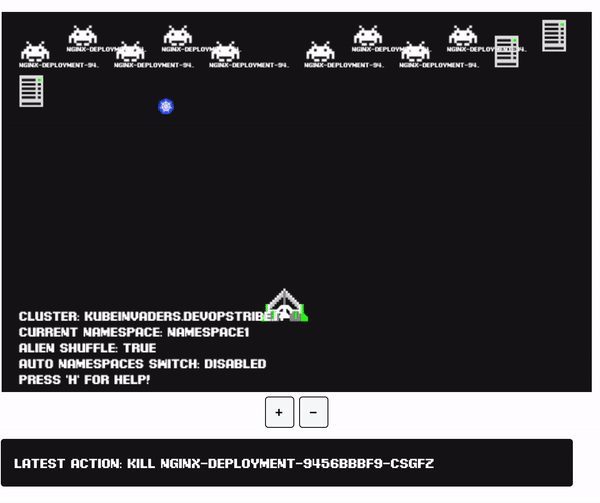

# kubeinvaders :space_invader: aka k-inv :joystick:

**Gamified Chaos Engineering Tool for K8s**

This project is part of landscape of [Cloud Native Computing Foudation](https://landscape.cncf.io/) in the Observability and Analysis - Chaos Engineering section.

Backed by the teams at [platformengineering.it](https://platformengineering.it) and [devopstribe.it](https://devopstribe.it), which provides enterprise-grade features and certified resilience services for your Kubernetes infrastructure.



We have embedded a demo on the DevOpsTRibe blog for you to try out the tool.

- Launch the demo at this link [https://kubeinvaders.platformengineering.it](https://kubeinvaders.platformengineering.it/)
- Watch the Grafana dashboard here [https://grafana.platformengineering.it](https://grafana.platformengineering.it)
- Monitor the pod status here [https://kubeopsview.platformengineering.it](https://kubeopsview.platformengineering.it)

[Here are the slides](https://www.slideshare.net/EugenioMarzo/kubeinvaders-chaos-engineering-practices-for-kubernetes1pdf) from the Chaos Engineering speech I prepared for FOSDEM 2023. Unfortunately, I could not be present at my talk, but I would still like to share them with the community.

# Table of Contents

1. [Description](#Description)
2. [Installation](#Installation)
3. [Usage](#Usage)
4. [Architecture](#Architecture)
5. [Persistence](#Persistence)
6. [Generic Troubleshooting & Known Problems](#Generic-Troubleshooting-And-Known-Problems)
7. [Troubleshooting Unknown Namespace](#Troubleshooting-Unknown-Namespace)
8. [Metrics](#Metrics)
9. [Security](#Security)
10. [Community](#Community)
11. [Community blogs and videos](#Community-blogs-and-videos)
12. [License](#License)

## Description

With **k-inv**, you can stress a K8s cluster in a fun way and check how resilient it is.

## Installation

### Run through Docker or Podman

Before you start, you need a token from a service account that has [this clusterrole](https://github.com/lucky-sideburn/kubeinvaders/blob/master/helm-charts/kubeinvaders/templates/rbac-cluster.yaml).

#### Example

Create the required components (assumes k8s v1.24+):

```bash
cat << 'EOF' | kubectl apply -f -
apiVersion: v1
kind: Namespace
metadata:
  name: kubeinvaders
---
apiVersion: rbac.authorization.k8s.io/v1
kind: ClusterRole
metadata:
  name: kinv-cr
rules:
  - apiGroups:
      - ""
    resources:
      - pods
      - pods/log
    verbs:
      - delete
  - apiGroups:
      - batch
      - extensions
    resources:
      - jobs
    verbs:
      - get
      - list
      - watch
      - create
      - update
      - patch
      - delete
  - apiGroups:
      - "*"
    resources:
      - "*"
    verbs:
      - get
      - watch
      - list
---
apiVersion: v1
kind: ServiceAccount
metadata:
  name: kinv-sa
  namespace: kubeinvaders
---
apiVersion: rbac.authorization.k8s.io/v1
kind: ClusterRoleBinding
metadata:
  name: kinv-crb
roleRef:
  apiGroup: rbac.authorization.k8s.io
  kind: ClusterRole
  name: kinv-cr
subjects:
  - kind: ServiceAccount
    name: kinv-sa
    namespace: kubeinvaders
---
apiVersion: v1
kind: Secret
type: kubernetes.io/service-account-token
metadata:
  name: kinv-sa-token
  namespace: kubeinvaders
  annotations:
    kubernetes.io/service-account.name: kinv-sa
EOF
```

Extract the token:

```bash
TOKEN=$(k get secret -n kubeinvaders -o go-template='{{.data.token | base64decode}}' kinv-sa-token)
```

Run the container:

```bash
podman run -p 3131:8080 \
--env K8S_TOKEN=$TOKEN \
--env ENDPOINT=localhost:3131 \
--env INSECURE_ENDPOINT=true \
--env KUBERNETES_SERVICE_HOST=10.10.10.4 \
--env KUBERNETES_SERVICE_PORT_HTTPS=6443 \
--env NAMESPACE=namespace1,namespace2 \
luckysideburn/kubeinvaders:v1.9.6
```

Given this example, you can access k-inv at the following address: [http://localhost:3131](http://localhost:3131)

- Please pay attention to the command "podman run -p 3131:8080". Forwarding port 8080 is important.
- We suggest using `INSECURE_ENDPOINT=true` for local development environments.
- Follow the instructions above to create the token for `K8S_TOKEN`.
- In the example, we use image tag `v1.9.6`, use `v1.9.6_debug` for debugging.

#### Params

##### K8S_TOKEN

These are the permissions your service account must have. You can take an example from [this clusterrole](https://github.com/lucky-sideburn/kubeinvaders/blob/master/helm-charts/kubeinvaders/templates/rbac-cluster.yaml).

- apiGroups: [""]
  resources: ["pods", "pods/log"]
  verbs: ["delete"]
- apiGroups: ["batch", "extensions"]
  resources: ["jobs"]
  verbs: ["get", "list", "watch", "create", "update", "patch", "delete"]
- apiGroups: ["*"]
  resources: ["*"]
  verbs: ["get", "watch", "list"]

##### ENDPOINT

Host and port of the web console.

##### INSECURE_ENDPOINT

Select HTTP or HTTPS for the web console.

##### KUBERNETES_SERVICE_HOST

IP address or DNS name of your control plane.

##### KUBERNETES_SERVICE_PORT_HTTPS

TCP port of the target control plane.

#### NAMESPACE

List the namespaces you want to stress or on which you want to see logs (logs are a beta feature, they might not work or could slow down the browser...).

```bash
docker run -p 8080:8080 \
--env K8S_TOKEN=<k8s_service_account_token>  \
--env ENDPOINT=localhost:8080 \
--env INSECURE_ENDPOINT=true \
--env KUBERNETES_SERVICE_HOST=<k8s_controlplane_host> \
--env KUBERNETES_SERVICE_PORT_HTTPS=<k8s_controlplane_port> \
--env NAMESPACE=<comma_separated_namespaces_to_stress> \
luckysideburn/kubeinvaders:develop
```

### Install to Kubernetes with Helm (v3+)

If you need a lab kubernetes cluster you can use this setup via Make and Minikube. Follow [this readme](./minikube-setup/README.md)

[](https://artifacthub.io/packages/search?repo=kubeinvaders)

```bash
helm repo add kubeinvaders https://lucky-sideburn.github.io/helm-charts/
helm repo update

kubectl create namespace kubeinvaders

helm install kubeinvaders --set-string config.target_namespace="namespace1\,namespace2" \
-n kubeinvaders kubeinvaders/kubeinvaders --set ingress.enabled=true --set ingress.hostName=kubeinvaders.io --set deployment.image.tag=v1.9.6
```

### Example for K3S

```bash
curl -sfL https://get.k3s.io | INSTALL_K3S_EXEC="--disable traefik" sh -s -

cat >/tmp/ingress-nginx.yaml <<EOF
apiVersion: v1
kind: Namespace
metadata:
  name: ingress-nginx
---
apiVersion: helm.cattle.io/v1
kind: HelmChart
metadata:
  name: ingress-nginx
  namespace: kube-system
spec:
  chart: ingress-nginx
  repo: https://kubernetes.github.io/ingress-nginx
  targetNamespace: ingress-nginx
  version: v4.9.0
  set:
  valuesContent: |-
    fullnameOverride: ingress-nginx
    controller:
      kind: DaemonSet
      hostNetwork: true
      hostPort:
        enabled: true
      service:
        enabled: false
      publishService:
        enabled: false
      metrics:
        enabled: false
        serviceMonitor:
          enabled: false
      config:
        use-forwarded-headers: "true"
EOF

kubectl create -f /tmp/ingress-nginx.yaml

kubectl create ns namespace1
kubectl create ns namespace2

export KUBECONFIG=/etc/rancher/k3s/k3s.yaml

helm install kubeinvaders --set-string config.target_namespace="namespace1\,namespace2" \
-n kubeinvaders kubeinvaders/kubeinvaders --set ingress.enabled=true --set ingress.hostName=kubeinvaders.io --set deployment.image.tag=v1.9.6
```

### Install to Kubernetes with Helm (v3+) - LoadBalancer / HTTP (tested with GKE)

```bash
helm install kubeinvaders --set-string config.target_namespace="namespace1\,namespace2" -n kubeinvaders kubeinvaders/kubeinvaders --set ingress.enabled=true --set ingress.hostName=kubeinvaders.local --set deployment.image.tag=v1.9.6 --set service.type=LoadBalancer --set service.port=80

kubectl set env deployment/kubeinvaders INSECURE_ENDPOINT=true -n kubeinvaders
```

### SCC for Openshift

```bash
oc adm policy add-scc-to-user anyuid -z kubeinvaders
```

### Route for Openshift

```bash
apiVersion: route.openshift.io/v1
kind: Route
metadata:
  name: kubeinvaders
  namespace: "kubeinvaders"
spec:
  host: "kubeinvaders.io"
  to:
    name: kubeinvaders
  tls:
    termination: Edge
```

## Usage

At the top you will find some metrics as described below:


**Current Replicas State Delay** is a metric that show how much time the cluster takes to come back at the desired state of pods replicas.

This is a control-plane you can use to switch off & on various features.


### YouTube HowTo

[Video How To of version v1.9](https://www.youtube.com/watch?v=wD7ngPlNEjY)

### Start The Chaos Experiment

Press the "Start" button to initiate the automatic pilot (the button changes to "Stop" to disable this feature).

### Enable Shuffle :joystick:

Press the "Enable Shuffle" button to randomly rearrange the positions of pods or K8s nodes (the button changes to "Disable Shuffle" to deactivate this feature).

### Enable Auto Jump Between Namespace :joystick:

Press the "Auto NS Switch" button to randomly switch between namespaces (the button changes to "Disable Auto NS Switch" to deactivate this feature).

### Show / Hide Pods Name :joystick:

Press the "Hide Pods Name" button to conceal the names of the pods beneath the aliens (the button changes to "Show Pods Name" to deactivate this feature).

### Information about Current Status and Events :joystick:

As described below, on the game screen near the spaceship, there are details about the current cluster, namespace, and some configurations.


Under the + and - buttons, a bar appears with the latest game events.


### Show Special Keys :joystick:

Press 'h' or select 'Show Special Keys' from the menu.

### Zoom In / Out :joystick:

Press the + or - buttons to increase or decrease the game screen.

### Chaos Containers for Master and Worker Nodes

- Select "Show Current Chaos Container for Nodes" from the menu to see which container starts when you attack a worker node (not an alien, they are pods).

- Select "Set Custom Chaos Container for Nodes" from the menu to use your preferred image or configuration against nodes.

## Persistence

K-inv uses Redis to save and manage data. Redis is configured with "appendonly."

Currently, the Helm chart does not support PersistentVolumes, but this task is on the to-do list...

## Generic Troubleshooting and Known Problems

- It seems that KubeInvaders does not work with EKS due to problems with ServiceAccount.
- Currently, the installation of KubeInvaders into a namespace that is not named "kubeinvaders" is not supported.
- I have only tested KubeInvaders with a Kubernetes cluster installed through KubeSpray.
- If you don't see aliens, please follow these steps:
  1.  Open a terminal and run "kubectl logs <pod_of_kubeinvader> -n kubeinvaders -f"
  2.  Execute the following command from another terminal: `curl "https://<your_kubeinvaders_url>/kube/pods?action=list&namespace=namespace1" -k`
  3.  Open an issue with attached logs.

## Troubleshooting Unknown Namespace

- Check if the namespaces declared with helm config.target_namespace (e.g., config.target_namespace="namespace1\,namespace2") exist and contain some pods.
- Check your browser's developer console for any failed HTTP requests (send them to luckysideburn[at]gmail[dot]com or open an issue on this repo).
- Try using v1.9.6_debug and send logs to luckysideburn[at]gmail[dot]com or open an issue on this repo.

## Prometheus Metrics

KubeInvaders exposes metrics for Prometheus through the standard endpoint /metrics.

Here is an example of Prometheus configuration:

```bash
scrape_configs:
- job_name: kubeinvaders
  static_configs:
  - targets:
    - kubeinvaders.kubeinvaders.svc.cluster.local:8080
```

Example of metrics:

| Metric                                                     | Description                                                  |
| ---------------------------------------------------------- | ------------------------------------------------------------ |
| chaos_jobs_node_count{node=workernode01}                   | Total number of chaos jobs executed per node                 |
| chaos_node_jobs_total                                      | Total number of chaos jobs executed against all worker nodes |
| deleted_pods_total 16                                      | Total number of deleted pods                                 |
| deleted_namespace_pods_count{namespace=myawesomenamespace} | Total number of deleted pods per namespace                   |


## Security

In order to restrict the access to the Kubeinvaders endpoint add this annotation into the ingress.

```yaml
nginx.ingress.kubernetes.io/whitelist-source-range: <your_ip>/32
```

## Community

Please reach out for news, bugs, feature requests, and other issues via:

- On Twitter: [@kubeinvaders](https://twitter.com/kubeinvaders) & [@luckysideburn](https://twitter.com/luckysideburn)
- New features are published on YouTube too in [this channel](https://www.youtube.com/channel/UCQ5BQ8R2fDL_WkNAllYRrpQ)

## Community blogs and videos

- [ AdaCon Norway Live Stream ](https://www.youtube.com/watch?v=rt_eM_KRfK4)
- [ LILiS - Linux Day 2023 Benevento ](https://www.youtube.com/watch?v=1tHkEfbGjgE)
- Kubernetes.io blog: [KubeInvaders - Gamified Chaos Engineering Tool for Kubernetes](https://kubernetes.io/blog/2020/01/22/kubeinvaders-gamified-chaos-engineering-tool-for-kubernetes/)
- acloudguru: [cncf-state-of-the-union](https://acloudguru.com/videos/kubernetes-this-month/cncf-state-of-the-union)
- DevNation RedHat Developer: [Twitter](https://twitter.com/sebi2706/status/1316681264179613707)
- Flant: [Open Source solutions for chaos engineering in Kubernetes](https://blog.flant.com/chaos-engineering-in-kubernetes-open-source-tools/)
- Reeinvent: [KubeInvaders - gamified chaos engineering](https://www.reeinvent.com/blog/kubeinvaders)
- Adrian Goins: [K8s Chaos Engineering with KubeInvaders](https://www.youtube.com/watch?v=bxT-eJCkqP8)
- dbafromthecold: [Chaos engineering for SQL Server running on AKS using KubeInvaders](https://dbafromthecold.com/2019/07/03/chaos-engineering-for-sql-server-running-on-aks-using-kubeinvaders/)
- Pklinker: [Gamification of Kubernetes Chaos Testing](https://pklinker.medium.com/gamification-of-kubernetes-chaos-testing-bd2f7a7b6037)
- Openshift Commons Briefings: [OpenShift Commons Briefing KubeInvaders: Chaos Engineering Tool for Kubernetes](https://www.youtube.com/watch?v=3OOXOCTAYF0&t=4s)
- GitHub: [awesome-kubernetes repo](https://github.com/ramitsurana/awesome-kubernetes)
- William Lam: [Interesting Kubernetes application demos](https://williamlam.com/2020/06/interesting-kubernetes-application-demos.html)
- The Chief I/O: [5 Fun Ways to Use Kubernetes ](https://thechief.io/c/editorial/5-fun-ways-use-kubernetes/?utm_source=twitter&utm_medium=social&utm_campaign=thechiefio&utm_content=articlesfromthechiefio)
- LuCkySideburn: [Talk @ Codemotion](https://www.slideshare.net/EugenioMarzo/kubeinvaders-chaos-engineering-tool-for-kubernetes-and-openshift)
- Chaos Carnival: [Chaos Engineering is fun!](https://www.youtube.com/watch?v=10tHPl67A9I&t=3s)
- Kubeinvaders (old version) + OpenShift 4 Demo: [YouTube_Video](https://www.youtube.com/watch?v=kXm2uU5vlp4)
- KubeInvaders (old version) Vs Openshift 4.1: [YouTube_Video](https://www.youtube.com/watch?v=7R9ftgB-JYU)
- Chaos Engineering for SQL Server | Andrew Pruski | Conf42: Chaos Engineering: [YouTube_Video](https://www.youtube.com/watch?v=HCy3sjMRvlI)
- nicholaschangblog: [Introducing Azure Chaos Studio](https://nicholaschangblog.com/azure/introduction-to-azure-choas-studio/)
- bugbug: [Chaos Testing: Everything You Need To Know](https://bugbug.io/blog/software-testing/chaos-testing-guide/)

## License

KubeInvaders is licensed under the Apache License, Version 2.0. See [LICENSE](./LICENSE) for the full license text.
