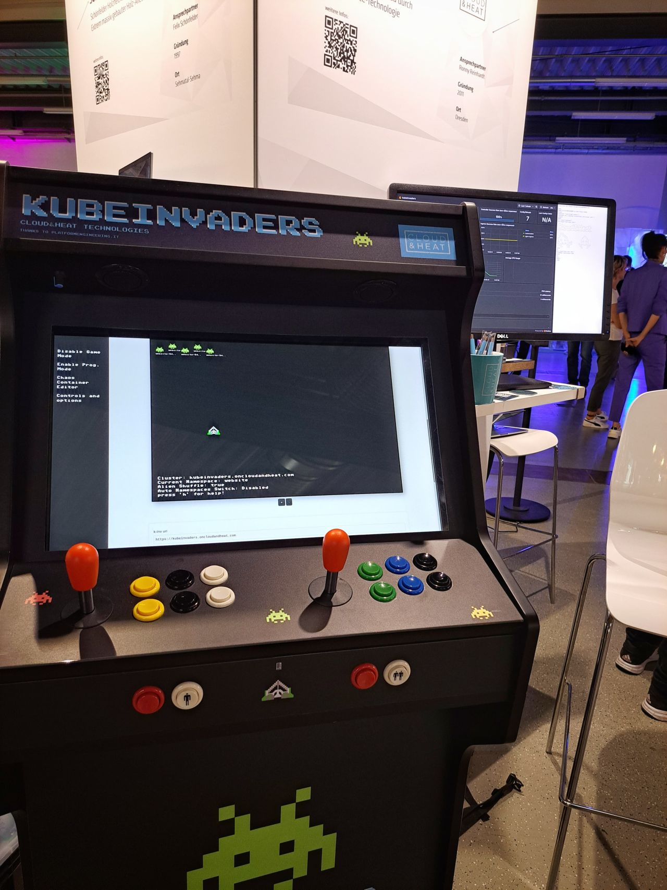
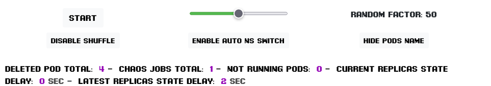
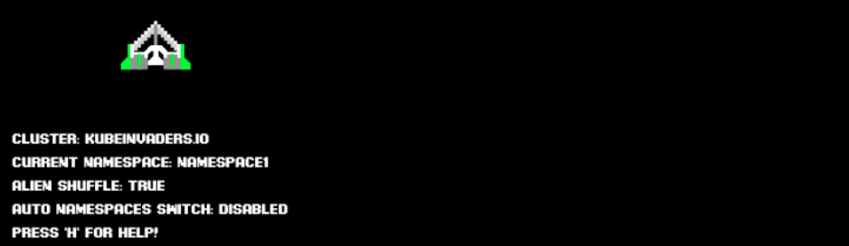
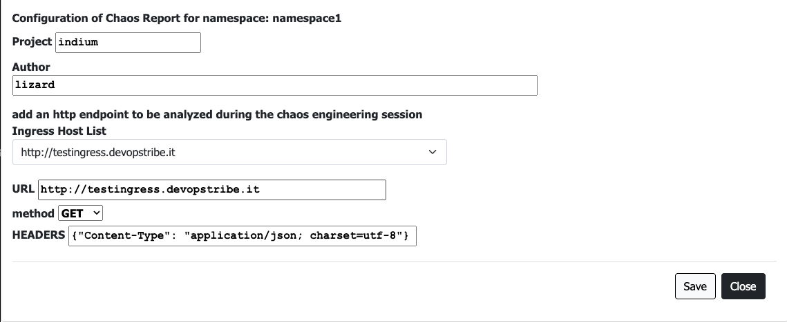
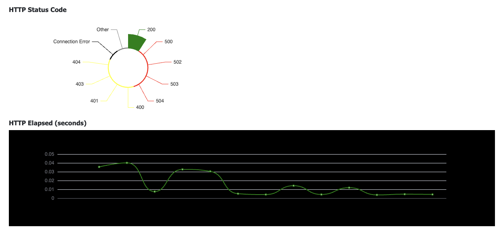
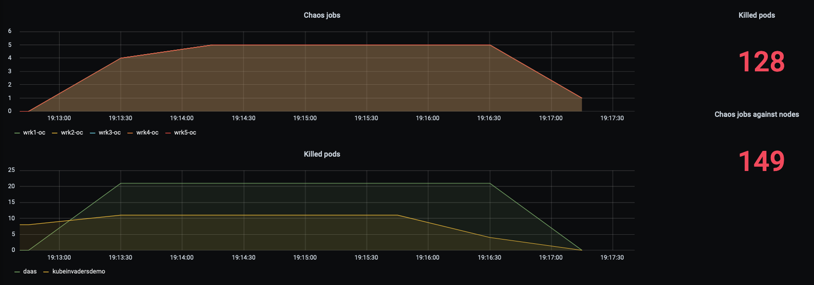
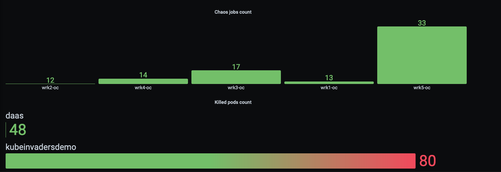
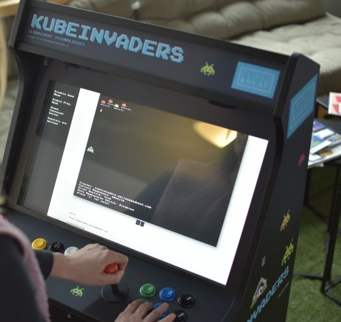

# kubeinvaders :space_invader: aka k-inv :joystick:

**Gamified Chaos Engineering and Educational Tool for Kubernetes**



This project, recommended by the CNCF (https://github.com/cncf/sandbox/issues/124), has a strong following and significant educational value. It's a chaos engineering tool, but it's also recommended for studying Kubernetes and resilience topics.

It is part of the Cloud Native Computing Foundation's (CNCF) landscape in the Observability and Analysis - Chaos Engineering section (https://landscape.cncf.io/).

Some companies use it for marketing at tech conferences in DevOps & SRE. For example at [𝗗𝗲𝗰𝗼𝗺𝗽𝗶𝗹𝗲𝗗 𝟮𝟬𝟮𝟱](https://www.linkedin.com/posts/cloud-%26-heat-technologies-gmbh_kubeinvaders-onpremise-managedkubernetes-activity-7293538807906258946-YtKV?utm_source=share&utm_medium=member_desktop&rcm=ACoAAAkOMNYBK7j_raLIIJBfs2RBA94_sK4Yeyg)

The teams at Platform Engineering (https://platformengineering.it/) and GDT - Garanti Del Talento ([https://www.garantideltalento.it/](https://www.garantideltalento.it)) back this project. They provide enterprise-grade features and SRE experts to help customers verify the resilience of their Kubernetes infrastructure.

Here are the slides (https://www.slideshare.net/EugenioMarzo/kubeinvaders-chaos-engineering-practices-for-kubernetes1pdf) from the Chaos Engineering speech I prepared for FOSDEM 2023. Unfortunately, I couldn't be present at my talk, but I still wanted to share them with the community."

# Table of Contents

1. [Description](#Description)
3. [Usage](#Usage)
4. [URL Monitoring During Chaos Session](#URL-Monitoring-During-Chaos-Session)
5. [Persistence](#Persistence)
6. [Generic Troubleshooting & Known Problems](#Generic-Troubleshooting-And-Known-Problems)
7. [Troubleshooting Unknown Namespace](#Troubleshooting-Unknown-Namespace)
8. [Metrics](#Metrics)
9. [Community](#Community)
10. [Community blogs and videos](#Community-blogs-and-videos)
11. [License](#License)

## Description

Inspired by the classic Space Invaders game, Kubeinvaders offers a playful and engaging way to learn about Kubernetes resilience by stressing a cluster and observing its behavior under pressure. This open-source project, built without relying on any external frameworks, provides a fun and educational experience for developers to explore the limits and strengths of their Kubernetes deployments

## Installation-default

**Helm installation is currently not supported.**

The easiest way to run KubeInvaders is directly with Podman or Docker.

Run with Podman:

```bash
podman run -p 8080:8080 docker.io/luckysideburn/kubeinvaders:latest
```

Run with Docker:

```bash
docker run --rm -p 8080:8080 docker.io/luckysideburn/kubeinvaders:latest
```

Then open:

```bash
http://localhost:8080
```

If you want to run KubeInvaders against your own Kubernetes cluster, create the required RBAC components (assumes k8s v1.24+):

Create the required components (assumes k8s v1.24+):

```bash
cat << 'EOF' | kubectl apply -f -
apiVersion: v1
kind: Namespace
metadata:
  name: kubeinvaders
---
apiVersion: rbac.authorization.k8s.io/v1
kind: ClusterRole
metadata:
  name: kinv-cr
rules:
  - apiGroups:
      - ""
    resources:
      - pods
      - pods/log
    verbs:
      - delete
  - apiGroups:
      - batch
      - extensions
    resources:
      - jobs
    verbs:
      - get
      - list
      - watch
      - create
      - update
      - patch
      - delete
  - apiGroups:
      - "*"
    resources:
      - "*"
    verbs:
      - get
      - watch
      - list
---
apiVersion: v1
kind: ServiceAccount
metadata:
  name: kinv-sa
  namespace: kubeinvaders
---
apiVersion: rbac.authorization.k8s.io/v1
kind: ClusterRoleBinding
metadata:
  name: kinv-crb
roleRef:
  apiGroup: rbac.authorization.k8s.io
  kind: ClusterRole
  name: kinv-cr
subjects:
  - kind: ServiceAccount
    name: kinv-sa
    namespace: kubeinvaders
---
apiVersion: v1
kind: Secret
type: kubernetes.io/service-account-token
metadata:
  name: kinv-sa-token
  namespace: kubeinvaders
  annotations:
    kubernetes.io/service-account.name: kinv-sa
---
apiVersion: rbac.authorization.k8s.io/v1
kind: ClusterRole
metadata:
  namespace: default
  name: kubevirt-vm-restart-role
rules:
- apiGroups: ["subresources.kubevirt.io"]
  resources: ["virtualmachines/restart"]
  verbs: ["update"]
---
apiVersion: rbac.authorization.k8s.io/v1
kind: ClusterRoleBinding
metadata:
  name: kubevirt-vm-restart-binding
  namespace: default
subjects:
- kind: ServiceAccount
  name: kubeinvaders
  namespace: kubeinvaders
roleRef:
  kind: ClusterRole
  name: kubevirt-vm-restart-role
  apiGroup: rbac.authorization.k8s.io
EOF
```

Extract the token:

```bash
TOKEN=$(k get secret -n kubeinvaders -o go-template='{{.data.token | base64decode}}' kinv-sa-token)
```
Create two namespaces:

```bash
kubectl create namespace namespace1
kubectl create namespace namespace2
```

## Usage

At the top you will find some metrics as described below:



**Current Replicas State Delay** is a metric that show how much time the cluster takes to come back at the desired state of pods replicas.

This is a control-plane you can use to switch off & on various features.


### Start The Chaos Experiment

Press the "Start" button to initiate the automatic pilot (the button changes to "Stop" to disable this feature).

### Enable Shuffle :joystick:

Press the "Enable Shuffle" button to randomly rearrange the positions of pods or K8s nodes (the button changes to "Disable Shuffle" to deactivate this feature).

### Enable Auto Jump Between Namespace :joystick:

Press the "Auto NS Switch" button to randomly switch between namespaces (the button changes to "Disable Auto NS Switch" to deactivate this feature).

### Show / Hide Pods Name :joystick:

Press the "Hide Pods Name" button to conceal the names of the pods beneath the aliens (the button changes to "Show Pods Name" to deactivate this feature).

### Information about Current Status and Events :joystick:

As described below, on the game screen near the spaceship, there are details about the current cluster, namespace, and some configurations.



Under the + and - buttons, a bar appears with the latest game events.


### Show Special Keys :joystick:

Press 'h' or select 'Show Special Keys' from the menu.

### Zoom In / Out :joystick:

Press the + or - buttons to increase or decrease the game screen.

### Chaos Containers for Master and Worker Nodes

- Select "Show Current Chaos Container for Nodes" from the menu to see which container starts when you attack a worker node (not an alien, they are pods).

- Select "Set Custom Chaos Container for Nodes" from the menu to use your preferred image or configuration against nodes.

# URL Monitoring During Chaos Session

During a chaos engineering session, you can monitor the behavior of an HTTP call exposed by an Ingress.

Use the flag "Add HTTP check & Chaos Report" and add the URL to monitor


Follow real time charts during the experiment




## Persistence

K-inv uses Redis to save and manage data. Redis is configured with "appendonly."

The legacy Helm chart does not support PersistentVolumes.

## Generic Troubleshooting and Known Problems
- If you don't see aliens, please follow these steps:  
- It seems that KubeInvaders does not work with EKS due to problems with ServiceAccount.
- Currently, the installation of KubeInvaders into a namespace that is not named "kubeinvaders" is not supported.
- I have only tested KubeInvaders with a Kubernetes cluster installed through KubeSpray.
- If you don't see aliens, please follow these steps:
  1.  Open a terminal and run "kubectl logs <pod_of_kubeinvader> -n kubeinvaders -f"
  2.  Execute the following command from another terminal: `curl "https://<your_kubeinvaders_url>/kube/pods?action=list&namespace=namespace1" -k`
  3.  Open an issue with attached logs.
- If you use route_host insted of ingress, please specify also the port like route_host: "kubeinvaders.example.com:8080". The port must be the same of the NodePort service

## Troubleshooting Unknown Namespace

- Check if the namespaces configured in the UI (for example: namespace1,namespace2) exist and contain pods.
- Check your browser's developer console for any failed HTTP requests (send them to luckysideburn[at]gmail[dot]com or open an issue on this repo).
- Try using latest_debug and send logs to luckysideburn[at]gmail[dot]com or open an issue on this repo.

## Prometheus Metrics

KubeInvaders exposes metrics for Prometheus through the standard endpoint /metrics.

Here is an example of Prometheus configuration:

```bash
scrape_configs:
- job_name: kubeinvaders
  static_configs:
  - targets:
    - kubeinvaders.kubeinvaders.svc.cluster.local:8080
```

Example of metrics:

| Metric                                                     | Description                                                  |
| ---------------------------------------------------------- | ------------------------------------------------------------ |
| chaos_jobs_node_count{node=workernode01}                   | Total number of chaos jobs executed per node                 |
| chaos_node_jobs_total                                      | Total number of chaos jobs executed against all worker nodes |
| deleted_pods_total 16                                      | Total number of deleted pods                                 |
| deleted_namespace_pods_count{namespace=myawesomenamespace} | Total number of deleted pods per namespace                   |






## Community

Please reach out for news, bugs, feature requests, and other issues via:

- On Twitter: [@kubeinvaders](https://twitter.com/kubeinvaders) & [@luckysideburn](https://twitter.com/luckysideburn)
- New features are published on YouTube too in [this channel](https://www.youtube.com/channel/UCQ5BQ8R2fDL_WkNAllYRrpQ)

## Community blogs and videos


- [The Kubernetes ecosystem is a candy store](https://opensource.googleblog.com/2024/06/the-kubernetes-ecosystem-is-candy-store.html)
- [ AdaCon Norway Live Stream ](https://www.youtube.com/watch?v=rt_eM_KRfK4)
- [ LILiS - Linux Day 2023 Benevento ](https://www.youtube.com/watch?v=1tHkEfbGjgE)
- Kubernetes.io blog: [KubeInvaders - Gamified Chaos Engineering Tool for Kubernetes](https://kubernetes.io/blog/2020/01/22/kubeinvaders-gamified-chaos-engineering-tool-for-kubernetes/)
- acloudguru: [cncf-state-of-the-union](https://acloudguru.com/videos/kubernetes-this-month/cncf-state-of-the-union)
- DevNation RedHat Developer: [Twitter](https://twitter.com/sebi2706/status/1316681264179613707)
- Flant: [Open Source solutions for chaos engineering in Kubernetes](https://blog.flant.com/chaos-engineering-in-kubernetes-open-source-tools/)
- Reeinvent: [KubeInvaders - gamified chaos engineering](https://www.reeinvent.com/blog/kubeinvaders)
- Adrian Goins: [K8s Chaos Engineering with KubeInvaders](https://www.youtube.com/watch?v=bxT-eJCkqP8)
- dbafromthecold: [Chaos engineering for SQL Server running on AKS using KubeInvaders](https://dbafromthecold.com/2019/07/03/chaos-engineering-for-sql-server-running-on-aks-using-kubeinvaders/)
- Pklinker: [Gamification of Kubernetes Chaos Testing](https://pklinker.medium.com/gamification-of-kubernetes-chaos-testing-bd2f7a7b6037)
- Openshift Commons Briefings: [OpenShift Commons Briefing KubeInvaders: Chaos Engineering Tool for Kubernetes](https://www.youtube.com/watch?v=3OOXOCTAYF0&t=4s)
- GitHub: [awesome-kubernetes repo](https://github.com/ramitsurana/awesome-kubernetes)
- William Lam: [Interesting Kubernetes application demos](https://williamlam.com/2020/06/interesting-kubernetes-application-demos.html)
- The Chief I/O: [5 Fun Ways to Use Kubernetes ](https://thechief.io/c/editorial/5-fun-ways-use-kubernetes/?utm_source=twitter&utm_medium=social&utm_campaign=thechiefio&utm_content=articlesfromthechiefio)
- LuCkySideburn: [Talk @ Codemotion](https://www.slideshare.net/EugenioMarzo/kubeinvaders-chaos-engineering-tool-for-kubernetes-and-openshift)
- Chaos Carnival: [Chaos Engineering is fun!](https://www.youtube.com/watch?v=10tHPl67A9I&t=3s)
- Kubeinvaders (old version) + OpenShift 4 Demo: [YouTube_Video](https://www.youtube.com/watch?v=kXm2uU5vlp4)
- KubeInvaders (old version) Vs Openshift 4.1: [YouTube_Video](https://www.youtube.com/watch?v=7R9ftgB-JYU)
- Chaos Engineering for SQL Server | Andrew Pruski | Conf42: Chaos Engineering: [YouTube_Video](https://www.youtube.com/watch?v=HCy3sjMRvlI)
- nicholaschangblog: [Introducing Azure Chaos Studio](https://nicholaschangblog.com/azure/introduction-to-azure-choas-studio/)
- bugbug: [Chaos Testing: Everything You Need To Know](https://bugbug.io/blog/software-testing/chaos-testing-guide/)
- Kinetikon: [Chaos Engineering: 5 strumenti open source](https://www.kinetikon.com/chaos-engineering-strumenti-open-source/)

## License

KubeInvaders is licensed under the Apache License, Version 2.0. See [LICENSE](./LICENSE) for the full license text.
