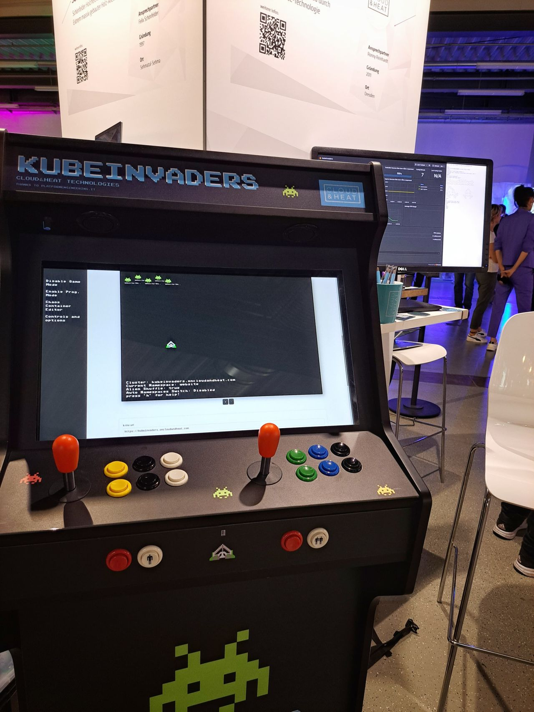
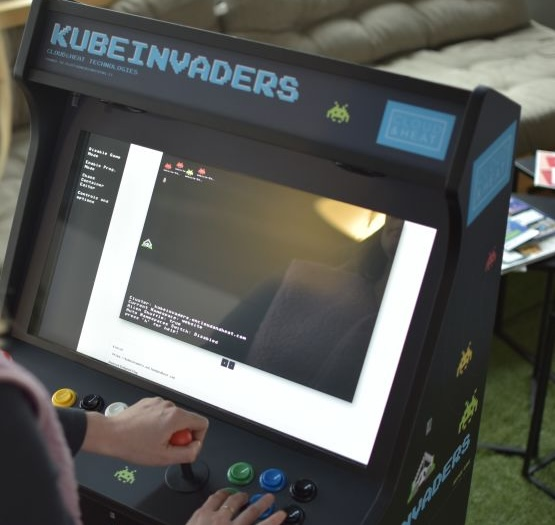

# kubeinvaders (the original) :space_invader: aka k-inv :joystick:

**Gamified Chaos Engineering and Educational Tool for Kubernetes**



Inspired by the classic Space Invaders game, KubeInvaders offers a playful way to learn about Kubernetes resilience: every alien is a pod or a node, shoot it and watch how your cluster reacts under pressure.

Recommended by the [CNCF](https://github.com/cncf/sandbox/issues/124) and listed in the [CNCF landscape](https://landscape.cncf.io/) (Observability and Analysis - Chaos Engineering), it is used for teaching Kubernetes, for resilience testing and at tech conferences such as [DecompileD 2025](https://www.linkedin.com/posts/cloud-%26-heat-technologies-gmbh_kubeinvaders-onpremise-managedkubernetes-activity-7293538807906258946-YtKV). The project is backed by [Platform Engineering](https://platformengineering.it/) and [GDT - Garanti Del Talento](https://www.garantideltalento.it), which provide enterprise-grade features and SRE experts. See also the [FOSDEM 2023 slides](https://www.slideshare.net/EugenioMarzo/kubeinvaders-chaos-engineering-practices-for-kubernetes1pdf).

## Table of Contents

1. [Quick Start (no cluster required)](#quick-start-no-cluster-required)
2. [Connect Your Cluster](#connect-your-cluster)
3. [Running Legacy Version v1.9.7](#running-legacy-version-v197)
4. [Documentation](#documentation)
5. [Community](#community)
6. [Community blogs and videos](#community-blogs-and-videos)
7. [License](#license)

## Quick Start (no cluster required)

The image embeds a demo Kubernetes cluster powered by [KWOK](https://kwok.sigs.k8s.io/), already connected to the game:

```bash
podman run --rm -p 8080:8080 docker.io/luckysideburn/kubeinvaders:latest
# or
docker run --rm -p 8080:8080 docker.io/luckysideburn/kubeinvaders:latest
```

Open http://localhost:8080 and start shooting. Nodes and pods are simulated: nothing real is deleted.

> **Want to use a real cluster?** You can switch at any time from the **Kubernetes Connection** form in the web console, or start the container with `-e KWOK_ENABLED=false` and your cluster settings: see [Connect Your Cluster](#connect-your-cluster).

Details and limitations in [docs/kwok.md](./docs/kwok.md).

## Connect Your Cluster

KubeInvaders runs as a container (Podman or Docker) and talks to your cluster with a ServiceAccount token.

> **Helm:** an official Helm chart is currently not supported, but you can create your own to run KubeInvaders inside your cluster. It only needs a Deployment exposing port `8080`, a ServiceAccount bound to the permissions in [manifests/kubeinvaders-rbac.yaml](./manifests/kubeinvaders-rbac.yaml), and the `NAMESPACE` environment variable. Inside a pod the built-in KWOK demo cluster is disabled automatically. The legacy chart in [helm-charts/](./helm-charts/) can be a starting point.

1. Create the RBAC (Kubernetes v1.24+) and the target namespaces:

   ```bash
   kubectl apply -f manifests/kubeinvaders-rbac.yaml
   kubectl create namespace namespace1
   kubectl create namespace namespace2
   ```

2. Get a token:

   ```bash
   TOKEN=$(kubectl get secret kinv-sa-token -n kubeinvaders -o go-template='{{.data.token | base64decode}}')
   # or a short-lived one
   TOKEN=$(kubectl create token kinv-sa -n kubeinvaders --duration=8h)
   ```

3. Run KubeInvaders and connect it to your cluster, in one of two ways:

   - **From the web console:** run the container without the demo cluster, open http://localhost:8080 and fill in the **Kubernetes Connection** form: API endpoint, token, namespaces (comma-separated) and, for self-signed clusters, the CA certificate. You can also load everything from a KUBECONFIG file.

     ```bash
     podman run --rm -p 8080:8080 -e KWOK_ENABLED=false docker.io/luckysideburn/kubeinvaders:latest
     ```

   - **With environment variables:**

     ```bash
     podman run --rm -p 8080:8080 \
       -e KWOK_ENABLED=false \
       -e K8S_TOKEN=$TOKEN \
       -e KUBERNETES_SERVICE_HOST=<api-server-host> \
       -e KUBERNETES_SERVICE_PORT_HTTPS=<api-server-port> \
       -e NAMESPACE=namespace1,namespace2 \
       -e DISABLE_TLS=true \
       docker.io/luckysideburn/kubeinvaders:latest
     ```

     `DISABLE_TLS=true` skips the verification of the API server certificate; drop it if your cluster certificate is trusted.

If the token is missing, invalid or expired, KubeInvaders cannot call the Kubernetes API and game actions will fail.

The demo cluster starts only when no cluster is configured: passing `K8S_TOKEN` or running KubeInvaders inside a pod disables it automatically, and `KWOK_ENABLED=false` makes it explicit. A slim image without KWOK can be built with `--build-arg WITH_KWOK=false`.

Step-by-step example with MiniKube: [docs/minikube.md](./docs/minikube.md).

## Running Legacy Version v1.9.7

If you need to run the legacy version v1.9.7, first extract the service account token:

```bash
TOKEN=$(kubectl get secret -n kubeinvaders -o go-template='{{.data.token | base64decode}}' kinv-sa-token)
```

Then run the container with the required environment variables pointing to your cluster:

```bash
podman run -p 8080:8080 \
  --env APPLICATION_URL=http://localhost:8080 \
  --env K8S_TOKEN=$TOKEN \
  --env INSECURE_ENDPOINT=true \
  --env KUBERNETES_SERVICE_HOST=192.168.39.182 \
  --env KUBERNETES_SERVICE_PORT_HTTPS=8443 \
  --env NAMESPACE=namespace1,namespace2 \
  local/kubeinvaders:v1.9.7
```

Replace `KUBERNETES_SERVICE_HOST` and `KUBERNETES_SERVICE_PORT_HTTPS` with your cluster's API server address and port, and set `NAMESPACE` to a comma-separated list of the namespaces you want to target.

## Documentation

- [Usage](./docs/usage.md): game controls, keyboard shortcuts and on-screen information
- [Features](./docs/features.md): chaos containers for nodes, URL monitoring during chaos sessions, persistence
- [Prometheus Metrics](./docs/prometheus.md): metrics and Grafana dashboard
- [Built-in KWOK demo cluster](./docs/kwok.md)
- [Example with Podman + MiniKube](./docs/minikube.md)
- [Troubleshooting](./docs/troubleshooting.md)

## Community

Please reach out for news, bugs, feature requests, and other issues via:

- On Twitter: [@kubeinvaders](https://twitter.com/kubeinvaders) & [@luckysideburn](https://twitter.com/luckysideburn)
- New features are published on YouTube too in [this channel](https://www.youtube.com/channel/UCQ5BQ8R2fDL_WkNAllYRrpQ)

## Community blogs and videos


- [The Kubernetes ecosystem is a candy store](https://opensource.googleblog.com/2024/06/the-kubernetes-ecosystem-is-candy-store.html)
- [ AdaCon Norway Live Stream ](https://www.youtube.com/watch?v=rt_eM_KRfK4)
- [ LILiS - Linux Day 2023 Benevento ](https://www.youtube.com/watch?v=1tHkEfbGjgE)
- Kubernetes.io blog: [KubeInvaders - Gamified Chaos Engineering Tool for Kubernetes](https://kubernetes.io/blog/2020/01/22/kubeinvaders-gamified-chaos-engineering-tool-for-kubernetes/)
- acloudguru: [cncf-state-of-the-union](https://acloudguru.com/videos/kubernetes-this-month/cncf-state-of-the-union)
- DevNation RedHat Developer: [Twitter](https://twitter.com/sebi2706/status/1316681264179613707)
- Flant: [Open Source solutions for chaos engineering in Kubernetes](https://blog.flant.com/chaos-engineering-in-kubernetes-open-source-tools/)
- Reeinvent: [KubeInvaders - gamified chaos engineering](https://www.reeinvent.com/blog/kubeinvaders)
- Adrian Goins: [K8s Chaos Engineering with KubeInvaders](https://www.youtube.com/watch?v=bxT-eJCkqP8)
- dbafromthecold: [Chaos engineering for SQL Server running on AKS using KubeInvaders](https://dbafromthecold.com/2019/07/03/chaos-engineering-for-sql-server-running-on-aks-using-kubeinvaders/)
- Pklinker: [Gamification of Kubernetes Chaos Testing](https://pklinker.medium.com/gamification-of-kubernetes-chaos-testing-bd2f7a7b6037)
- Openshift Commons Briefings: [OpenShift Commons Briefing KubeInvaders: Chaos Engineering Tool for Kubernetes](https://www.youtube.com/watch?v=3OOXOCTAYF0&t=4s)
- GitHub: [awesome-kubernetes repo](https://github.com/ramitsurana/awesome-kubernetes)
- William Lam: [Interesting Kubernetes application demos](https://williamlam.com/2020/06/interesting-kubernetes-application-demos.html)
- The Chief I/O: [5 Fun Ways to Use Kubernetes ](https://thechief.io/c/editorial/5-fun-ways-use-kubernetes/?utm_source=twitter&utm_medium=social&utm_campaign=thechiefio&utm_content=articlesfromthechiefio)
- LuCkySideburn: [Talk @ Codemotion](https://www.slideshare.net/EugenioMarzo/kubeinvaders-chaos-engineering-tool-for-kubernetes-and-openshift)
- Chaos Carnival: [Chaos Engineering is fun!](https://www.youtube.com/watch?v=10tHPl67A9I&t=3s)
- Kubeinvaders (old version) + OpenShift 4 Demo: [YouTube_Video](https://www.youtube.com/watch?v=kXm2uU5vlp4)
- KubeInvaders (old version) Vs Openshift 4.1: [YouTube_Video](https://www.youtube.com/watch?v=7R9ftgB-JYU)
- Chaos Engineering for SQL Server | Andrew Pruski | Conf42: Chaos Engineering: [YouTube_Video](https://www.youtube.com/watch?v=HCy3sjMRvlI)
- nicholaschangblog: [Introducing Azure Chaos Studio](https://nicholaschangblog.com/azure/introduction-to-azure-choas-studio/)
- bugbug: [Chaos Testing: Everything You Need To Know](https://bugbug.io/blog/software-testing/chaos-testing-guide/)
- Kinetikon: [Chaos Engineering: 5 strumenti open source](https://www.kinetikon.com/chaos-engineering-strumenti-open-source/)

## License

KubeInvaders is licensed under the Apache 2.0 License.
See [LICENSE](./LICENSE) for the full license text.
