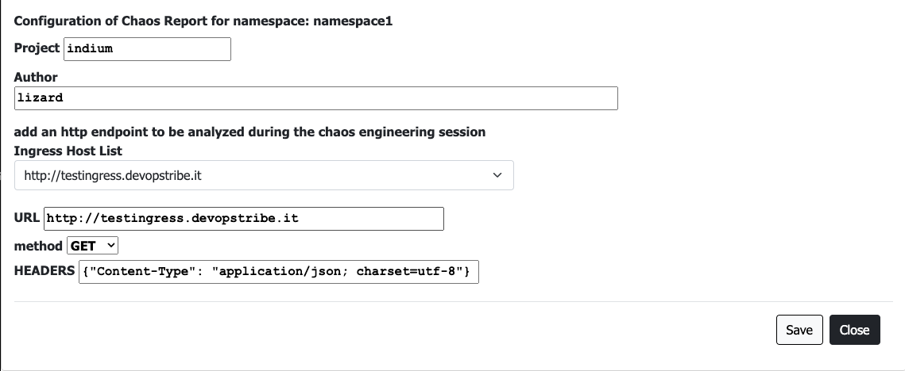
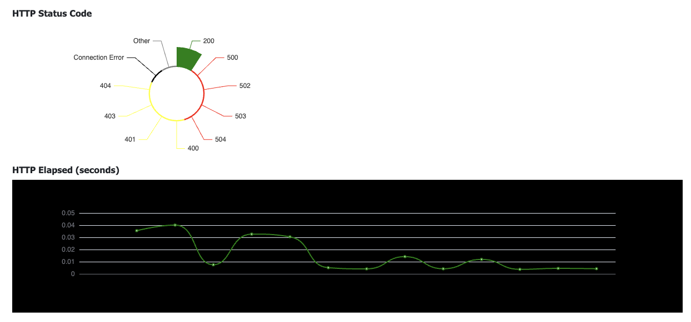

# Features

## Chaos Containers for Nodes

When you hit a node (not an alien, aliens are pods) KubeInvaders runs a Kubernetes Job against it. Use **Show Current Chaos Container for Nodes** to see its definition and **Set Custom Chaos Container for Nodes** to use your own image or configuration.

## URL Monitoring During Chaos Session

Press **Select Ingress** (next to **Check Ingress HTTP during Chaos Experiment**) and pick an Ingress host or type the URL of the service to monitor: follow its behavior on real-time charts during the experiment.

## Persistence

KubeInvaders stores its data in an embedded Redis configured with `appendonly`.
