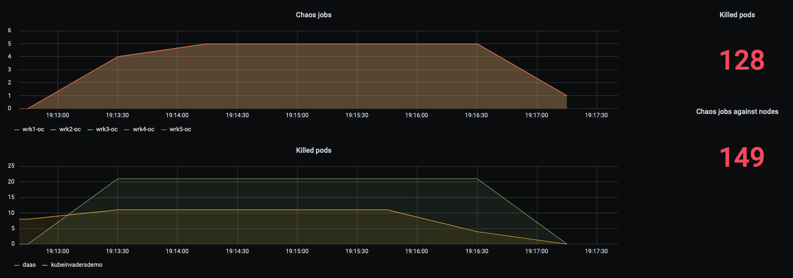

# Prometheus Metrics

KubeInvaders exposes Prometheus metrics at `/metrics`:

```yaml
scrape_configs:
- job_name: kubeinvaders
  static_configs:
  - targets:
    - kubeinvaders.kubeinvaders.svc.cluster.local:8080
```

| Metric | Description |
| --- | --- |
| `chaos_jobs_node_count{node="workernode01"}` | Chaos jobs executed per node |
| `chaos_node_jobs_total` | Chaos jobs executed against all worker nodes |
| `deleted_pods_total` | Deleted pods |
| `deleted_namespace_pods_count{namespace="myawesomenamespace"}` | Deleted pods per namespace |

A ready-made [Grafana dashboard](../confs/grafana/KubeInvadersDashboard.json) is available.


