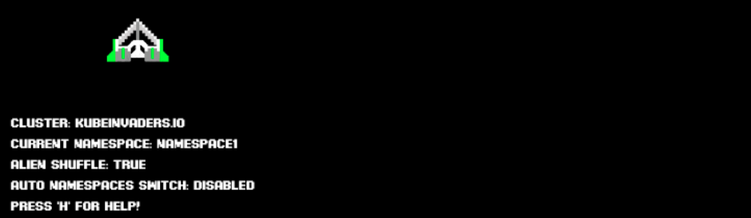

# Usage

| Control | What it does |
| --- | --- |
| **Start** / **Stop** | Starts or stops the automatic pilot |
| **Enable Shuffle** | Randomly rearranges the positions of pods or nodes |
| **Auto NS Switch** | Randomly switches between the configured namespaces |
| **Hide Pods Name** | Hides the pod names beneath the aliens |
| **+** / **-** | Zooms the game screen in or out |
| **h** or **Show Special Keys** | Shows all keyboard shortcuts |

Near the spaceship the game shows the current cluster, namespace and settings; under the zoom buttons a bar shows the latest game events.

